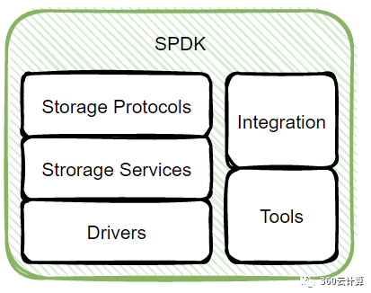
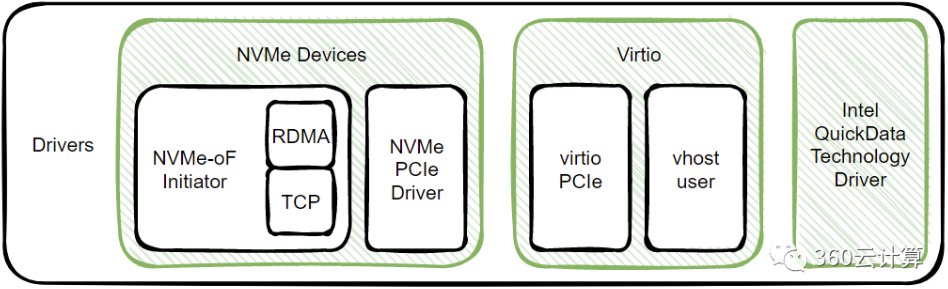
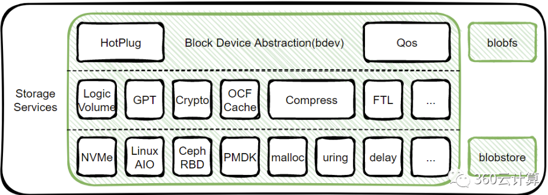
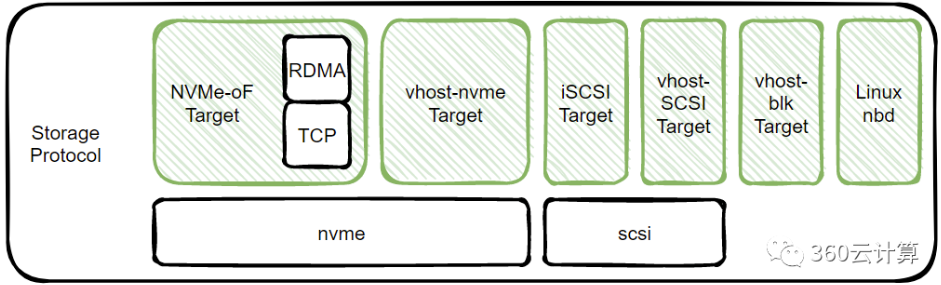
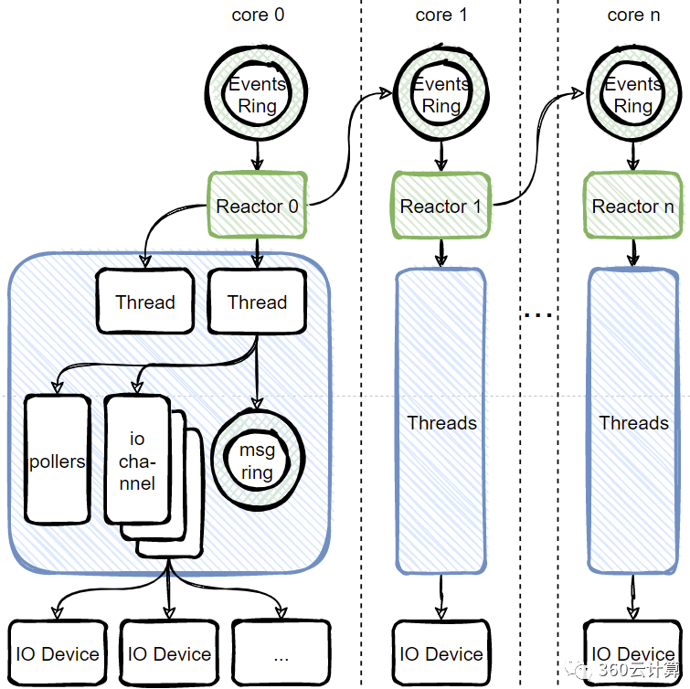
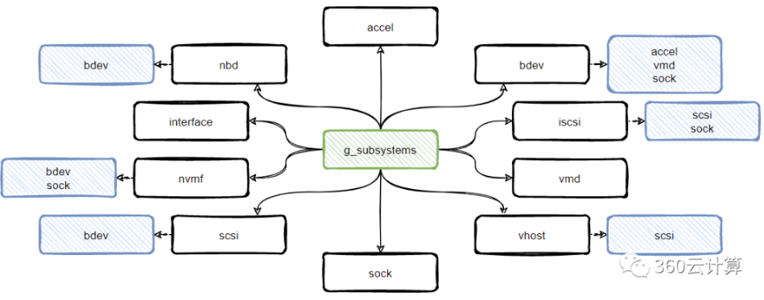

# SPDK介绍

SPDK是Intel针对NVMe SSD开源的高性能存储框架，它能够减低IO路径上软件栈所占用的耗时占比，从而尽可能发挥出硬件设备的性能。

硬件处理数据的占比在整个IO路径中越来也少，软件处理开销占比越来越高，传统的驱动方式成为了IO性能无法继续提升的罪魁祸首，SPDK由此应运而生。

SPDK的主要特征

- **用户态驱动程序：** SPDK 是一个完全在用户态运行的存储栈，通过绕过操作系统内核和传统的存储协议栈，直接在用户态处理存储操作，从而提高了存储系统的性能和效率。
- **Bdev（块设备）抽象层：** SPDK 提供了一个灵活的块设备抽象层，允许应用程序轻松管理和操作不同类型的块设备，如NVMe SSD、RAM Disk等。它提供了丰富的API和功能，使开发者能够快速开发高性能的存储应用程序。
- **轮询：**在传统的I/O模型中，应用程序提交读写请求后进入睡眠状态，一旦I/O完成，中断就会将其唤醒。轮询的工作方式则不同，应用程序提交读写请求后继续执行其他工作，以一定的时间间隔回头检查I/O是否已经完成。这种方式避免了中断带来的延迟和开销，并使得应用程序提高了I/O效率。

## SPDK基础知识

为什么要分配大页？

原理：dpdk大页内存原理

- 所有大页以及大页表都以共享内存存放在**共享内存**中，永远都不会因为内存不足而导致被交换到磁盘swap分区中
- 由于所有进程都共享一个大页表，减少了页表的开销，无形中减少了内存空间的占用， 使得系统支持更多的进程同时运行
- 减轻TLB的压力
- 减轻查内存的压力

目前 Linux 常用的 HugePages 大小为 2MB 和 1GB。

## SPDK架构

如上图，是SPDK的整体架构，从下至上，最底层是最核心的用户态NVMe驱动，这是SPDK的基石；

再往上一层是基于用户态驱动程序构建的存储服务，这部分主要是统一抽象的块设备层，包含了用户空间块设备语义的抽象和多个不同后端存储实现；

在块设备之上，SPDK提供了标准存储协议的实现，使得SPDK可以为通用存储客户端提供高性能的存储服务。

除此之外，SPDK还包含了用于管理运行环境、不同层内的管理开发工具，方便开发者的日常开发测试；为了适配更多的使用环境，SPDK也集成了不同的社区组件、如用户空间TCP/IP协议栈VPP、KV存储引擎RocksDB、缓存加速框架OCF等。

### 驱动层

用户态驱动是SPDK构建其他服务的基础，主要实现了基于PCIe的NVMe协议，用于在用户态驱动NVMe SSD，也实现了NVMe-over-Fabric(NVMe-oF)用于连接网络的NVMe设备，其中Fabric在SPDK中支持RDMA和TCP两种实现方式；驱动层还包含了其他两类驱动，Virtio用于加速虚拟机IO，I/OAT是通过提高数据拷贝效率的IO加速引擎。

### 存储服务层

存储服务层主要在用户空间对块设备语义进行了统一封装抽象，并开发了不同的实现，用于支持不同的后端存储，比如NVMe bdev支持SPDK NVMe驱动管理本地NVMe SSD或则使用NVMe-oF连接远端服务器的NVMe SSD，Ceph RBD用于对接Ceph块存储，AIO和uring等则使用不同的IO模型管理内核块设备；有一类bdev被称为vbdev，它们基于原本的bdev之上实现了一定的功能，比如逻辑卷管理、分区表、缓存加速等，对于更上层的应用来说，它们还是属于bdev。

bdev本身并没有任何元数据，服务重启需要手动或则使用配置文件重新进行配置，blobstore则是基于bdev之上的具有持久化元数据的存储引擎，如果bdev具有持久化能力，则blobstore能够在掉电后进行恢复，blobstore将整个bdev分成blob进行管理，支持对blob进行创建、删除、写入、读取、快照、克隆、flatten等操作；blobfs则是基于blobstore实现的简易文件系统，一个文件会对应一个blob，本身不兼容POSIX语义，目前的只能对文件进行追加写，不能修改，主要用于和RocksDB进行集成用于作为高性能的KV存储。

### 存储协议层

SPDK在存储协议层主要实现了基于网络的块存储协议，将bdev暴露到网络中供其他服务进行使用，除了支持NVMe-oF协议之外，还支持iSCSI、nbd等协议；由于bdev层屏蔽掉了后端存储的实现，所以可以按需使用不同的协议将bdev进行暴露，如将Ceph RBD暴露成NVMe设备给客户端使用。

## 应用编程框架

SPDK应用在启动的时候，可以指定线程数量，用掩码的方式进行标识，标识在哪几个指定的CPU核上运行，如上图所示，一个核就会运行一个线程，SPDK把它称为reactor。

SPDK实现了各类子系统、应用服务在调用spdk_app_start方法启动时，除了会按模型初始化线程外，还会对注册的各个子系统进行初始化。下图是SPDK支持的子系统以及子系统间的依赖关系，在SPDK框架中bdev也是作为一个子系统存在，用于提供通用的用户态块存储抽象，和内核的通用块层类似，它会屏蔽底层模块(Module)具体的实现，对外提供统一的接口，当然，对底层模块要求也是需要实现对应的API。

