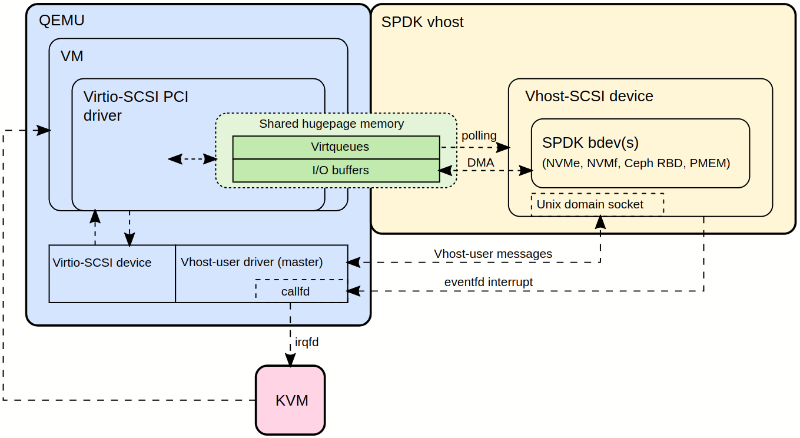

# 20211011-20211017

## 本周工作

1. 了解自动组卷系统的总体功能和具体需求。分为教师端和学生端。教师端可以录入题目，知识点分类，对学生的学习情况进行分析，生成试题，生成试卷。学生端能够进行答题和结果校验。
2. 初步掌握并构建neo4j数据库，初步在服务器构建知识点结构。
3. 用python实现三个功能（控制台输入输出）：题目录入、知识点录入、根据简单要求随机组题。

## 任务进度

### Python自动组卷系统

1. 了解系统大概
2. 设计并搭建数据库
3. python控制台实现基础功能（当前完成这一阶段）
4. 构建基础UI端：实现录入题目、出题等基础功能
5. 实现更丰富的功能：学生成绩的分析，更复杂的条件出题

## 下周任务工作计划

1. 阅读并熟悉蒋老师发的文章
2. 搭建”键值对“工作的环境
3. 初步熟悉Python前后端工作，学习Django，在Centos服务器搭建python的web程序
4. 完成Python自动组卷系统的第四阶段
5. 初步设计学生端的数据库如何和知识题目的数据库结合

# 20211018-20211022

## 本周工作

1. 在服务器配置django+uwsgi+nginx的环境
2. 配置使用pycharm可以远程调试服务器项目的环境
3. 学习如何在django中调用neo4j数据库内容
4. 学习django如何实现web项目开发，比如url的使用，html的搭配
5. 记录搭建环境中不断遇到的问题和解决办法
6. 阅读“键值对”论文的前两章

## 任务进度

### Python自动组卷系统

1. 了解系统大概
2. 设计并搭建数据库
3. python控制台实现基础功能
4. 构建基础UI端：实现录入题目、出题等基础功能（当前处于这一阶段进行中，还在不断摸索）
5. 实现更丰富的功能：学生成绩的分析，更复杂的条件出题

## 下周任务工作计划

1. 完成Python自动组卷系统的第四阶段
2. 阅读完论文


# 20211025-20211029

## 本周工作

1. 完成neo4j到echarts的数据转换与显示
2. 完成neo4j数据库内容在前端的基础显示(只有节点title和边)，搭建教师端的index界面）
3. 完成从前端向数据库添加、删除、更改知识、题目节点和节点之间的关系
4. 完成教师端的出卷功能和试卷内容和答案的下载
5. 与蒋老师讨论后续进展
6. index界面构建目录树

## 任务进度

### Python自动组卷系统

1. 完成前端向服务器添加知识节点的功能
2. 完成前端向服务器添加题目节点的功能
3. 完成节点删除和更改的功能（只能对已有节点的属性值进行更改，无法动态增加或者删除某类节点的属性）
4. 完成出卷的功能
5. 教师端index界面展示目录树，增加空白属性以备后续使用，增加节点改成下拉框，自动判卷功能（**目前处于此阶段**）
6. 学生端的主页设计
7. 学生端的自动出题功能
8. 学生的知识掌握情况的数据库设计和融入并将学生的知识掌握情况融入教师端的系统中
9. 教师端和学生端的分开登录的功能

## 下周任务工作计划

1. 完成上述第五阶段后与蒋老师讨论
2. 将系统复制到学校的阿里云服务器中

# 20211101-20211105

## 本周工作

1. 一周都在感冒，看病
2. 实现首页目录树的构建以及和结构图的交互
3. 实现动态添加知识节点，父节点使用下拉框显示
4. 实现动态添加题目节点，多个父节点也可以使用下拉框显示
5. 实现项目的迁移，从自己的腾讯云服务器迁移到了学校的阿里云
6. 实现教师端从所有题目中进行选择从而出卷
7. 修改**中南大学教师教学发展中心教学学术研究专项基金项目申 请 表**

## 任务进度

### Python自动组卷系统

1. 完成前端向服务器添加知识节点的功能
2. 完成前端向服务器添加题目节点的功能
3. 完成节点删除和更改的功能（只能对已有节点的属性值进行更改，无法动态增加或者删除某类节点的属性）
4. 完成出卷的功能
5. 教师端index界面展示目录树，增加空白属性以备后续使用，增加节点改成下拉框。
6. 实现自动出卷，自动判卷功能（**目前处于此阶段**）
7. 学生端的主页设计
8. 学生端的自动出题功能
9. 学生的知识掌握情况的数据库设计和融入并将学生的知识掌握情况融入教师端的系统中
10. 教师端和学生端的分开登录的功能

## 下周任务工作计划

1. 与谭勋勇见面并介绍系统（这周由于感冒原因一直没有见面）
2. 实现自动判卷功能
3. 设计并搭建学生端主页

# 20211108-20211112

## 本周工作

1. 完成**中南大学教师教学发展中心教学学术研究专项基金项目申请表**的修改
2. 优化系统的出卷预览功能和题目选择功能
3. 完成平台的自动判卷功能，选择题、填空题和编程题目均可以在后端进行答案比对
4. 完成对系统知识节点和题目节点插入时的查重功能
5. 给谭勋勇介绍系统的具体内容，并告诉他应该重点学习python的哪一个方向
6. 完成群晖的交接任务，实验室成员的账号分配和公网访问

## 任务进度

### Python自动组卷系统

1. 完成前端向服务器添加知识节点的功能
2. 完成前端向服务器添加题目节点的功能
3. 完成节点删除和更改的功能（只能对已有节点的属性值进行更改，无法动态增加或者删除某类节点的属性）
4. 完成出卷的功能
5. 教师端index界面展示目录树，增加空白属性以备后续使用，增加节点改成下拉框。
6. 实现自动出卷，自动判卷功能
7. 插入真实数据（目前处于此阶段）
8. 学生的知识掌握情况的数据库设计和融入并将学生的知识掌握情况融入教师端的系统中
9. 学生端的主页设计
10. 教师端和学生端的分开登录的功能

## 下周任务工作计划

1. 在谭勋勇的协助下将搭建真实数据的数据库
2. 继续在实验数据库中完成学生端的设计
3. 群晖搭建gitlab
4. 读完论文

# 20211115-2021111219

## 本周工作

1. 读完论文《分布式键值存储系统中延迟优化研究》，正在阅读论文《Gimbal JBOFs》。
2. 完成知识节点和题目节点属性的设计。
3. 完成第一章节知识节点的添加
4. 完成平台学生端的部分搭建，实现教师端和学生端的作业交互
5. 群晖：完成远程使用ssh登录，搭建群晖本地gitlab，进行账号分配。

## 任务进度

### Python自动组卷系统

1. 完成前端向服务器添加知识节点、题目节点的功能
2. 完成节点删除和更改的功能（只能对已有节点的属性值进行更改，无法动态增加或者删除某类节点的属性）
3. 完成出卷的功能
4. 教师端index界面展示目录树，增加空白属性以备后续使用，增加节点改成下拉框。
5. 实现自动出卷，自动判卷功能
6. 插入真实数据
7. 学生端的主页设计
8. 学生节点的设计（目前处于此阶段）
9. 系统对每次作业所有题目的答题情况进行统计：每个知识点的被掌握程度
10. 系统对每个学生的学习情况进行统计：学生每次的小测成绩，学生对每个知识点的掌握程度
11. 教师端和学生端的分开登录的功能

## 下周任务工作计划

1. 完成群晖gitlab搭建，完成群晖的使用手册
2. 阅读完论文《Gimbal JBOFs》
3. 设计平台如何对学生学习状态进行记录，并实现部分功能

# 20211122-2021111126

## 本周工作

1. 完成群晖的远程web端登录，群晖内gitlab的配置与账号管理，完成gitlab的远程登录与远程代码管理功能。完成群晖的使用手册
2. 写教学辅助平台文档，写作方式一直有问题。所以计划开始写毕业论文中的需求分析的部分（开始画图）。
3. 和谭勋勇沟通，目前已经完成了远程操作服务器的功能但是没有办法跑起来。约好下周二和他见面，帮他看看问题。（由于本科生的假期提前，导致他没有了周末，可能需要减轻给他的工作）
4. 找到了gimbal论文的视频，进行粗略学习。
5. 完成教学辅助平台登录端的功能(初版)。

## 任务进度

### Python自动组卷系统

1. 完成前端向服务器添加知识节点、题目节点的功能
2. 完成节点删除和更改的功能（只能对已有节点的属性值进行更改，无法动态增加或者删除某类节点的属性）
3. 完成出卷的功能
4. 教师端index界面展示目录树，增加空白属性以备后续使用，增加节点改成下拉框。
5. 实现自动出卷，自动判卷功能
6. 学生端的主页设计与学生节点的设计
7. 利用session实现教师端和学生端，以及学生端内部的分开登录的功能（目前处于此阶段）
8. 系统对每次作业所有题目的答题情况进行统计：每个知识点的被掌握程度
9. 系统对每个学生的学习情况进行统计：学生每次的小测成绩，学生对每个知识点的掌握程度

## 下周任务工作计划

1. 熟悉蒋老师发的华为项目的问题二，结合汲发师兄的论文与gimbal的论文进行构思，看看是否有idea
2. 完成平台的session部分。
3. 设计出较为完整的平台需求分析文档与清晰明了的图例
4. 帮助谭勋勇跑通程序并让他看懂代码

# 20211129-20211203

## 本周工作

1. 完成毕设任务书

2. 了解华为项目，学习网卡的基本知识，安装网卡驱动，正在复现论文中的对比试验部分。

3. 完成实验环境的硬件搭建。

4. 和谭勋勇沟通，成功再他的电脑中跑通代码。

5. 完成教学辅助平台登录端的功能的修改，实现了强制登陆的功能。

6. 完成教学辅助平台的功能模块图和数据流图。

   

   


## 任务进度

### Python自动组卷系统

1. 完成前端向服务器添加知识节点、题目节点的功能
2. 完成节点删除和更改的功能（只能对已有节点的属性值进行更改，无法动态增加或者删除某类节点的属性）
3. 完成出卷的功能
4. 教师端index界面展示目录树，增加空白属性以备后续使用，增加节点改成下拉框。
5. 实现自动出卷，自动判卷功能
6. 学生端的主页设计与学生节点的设计
7. 利用session实现教师端和学生端，以及学生端内部的分开登录的功能
8. 整理需求，绘制流程图和功能图，完成部分毕业论文（目前处于此阶段）
9. 系统对每次作业所有题目的答题情况进行统计：每个知识点的被掌握程度
10. 系统对每个学生的学习情况进行统计：学生每次的小测成绩，学生对每个知识点的掌握程度

### 华为智能网卡项目（实现论文中的对比试验）

1. 搞懂论文中的对比实验是如何做的

2. 找到两台拥有X5网卡的机器

3. 安装驱动，将机器连通（目前处于此阶段）

   ```
   由于当前的两个机子一个是Centos6，另一个是Ubuntu18.04，版本差的太多，所以导致两个机器对应的驱动没有办法很好的实现网卡的对接，所以正在将CentOS6升级为CentOS7，然后安装CentOS7对应的网卡驱动，从而实现和Ubuntu18.04的相对应
   ```

4. 配置实验中发包的频率和数量以及流的大小

5. 运行实验

6. 对两个机器中的吞吐量进行统计

## 下周任务工作计划

1. 继续熟悉蒋老师发的华为项目的问题二，并阅读田荘师兄和蒋老师提供的论文，熟悉实验环境。整理问题
2. 完成毕设任务计划书
3. 跑通论文中的对比试验
4. 着手写毕设论文的需求分析部分

# 20211206-20211210

## 本周工作

1. 完成毕设任务书,找到翻译文章
2. 进行系统的重装，两个机器的网卡驱动安装相同版本，实验环境硬件部分配置成功
3. 找到了网卡驱动的开发手册、rdma编程的用户使用手册、infiniband的制作标准三个参考手册，方便查阅
4. 了解rdma的基本知识，跑通了edma编程用户使用手册中的srq的示例。证明环境是没有问题的。

## 任务进度

### Python自动组卷系统

1. 完成前端向服务器添加知识节点、题目节点的功能
2. 完成节点删除和更改的功能（只能对已有节点的属性值进行更改，无法动态增加或者删除某类节点的属性）
3. 完成出卷的功能
4. 教师端index界面展示目录树，增加空白属性以备后续使用，增加节点改成下拉框。
5. 实现自动出卷，自动判卷功能
6. 学生端的主页设计与学生节点的设计
7. 利用session实现教师端和学生端，以及学生端内部的分开登录的功能
8. 整理需求，绘制流程图和功能图，完成部分毕业论文（目前处于此阶段）
9. 系统对每次作业所有题目的答题情况进行统计：每个知识点的被掌握程度
10. 系统对每个学生的学习情况进行统计：学生每次的小测成绩，学生对每个知识点的掌握程度

### 华为智能网卡项目（实现华为项目中的多个applications共享srq）

1. 找到两台拥有X5网卡的机器

2. 安装驱动，将机器连通

   ```
   由于当前的两个机子一个是Centos6，另一个是Ubuntu18.04，版本差的太多，所以导致两个机器对应的驱动没有办法很好的实现网卡的对接，所以正在将CentOS6升级为CentOS7，然后安装CentOS7对应的网卡驱动，从而实现和Ubuntu18.04的相对应
   ```

3. 找到示例代码，进行解读（目前处于此阶段）

4. 设计实验数据

5. 运行实验

6. 对两个机器中的吞吐量进行统计（使用ibumbs工具和wireshark进行抓包）

## 下周任务工作计划

1. 继续熟悉蒋老师发的华为项目的问题二
2. 读懂用户手册中和srq相关的代码
3. 学习ibumbs（rdma抓包工具）和wireshark如何进行抓包
4. 对代码进行更新，表达问题二

# 20211213-20211217

## 本周工作

1. 安装wireshark，tcpdump等抓包工具并学习

2. 学习rdma用户手册中的关于srq和基本操作的代码，并配置基本环境跑通代码。

3. 重新回顾华为问题，了解实验目标。通过使用NVMe-oF方法来实现一个机器向另一个机器的ssd写入内容。通过RDMA方法中的ROCEV2传输层协议可以实现NVMe的功能，使RDMA作为NVMe协议的载体。

   减少SRQ的深度，客户端向服务器端读取硬盘内容，创建多个QP向硬盘发起send请求导致SRQ中的WQE供不应求，观察RNR。

4. 学习NVMe的相关知识，发现当前实验所用的两台机器的固态硬盘并非是支持NVMe协议的，是SATA硬盘。

5. 手动升级tcpdump和libpcap，实现能够对ROCE进行抓包。

## 任务进度

### 华为智能网卡项目

1. 找到两台拥有X5网卡的机器

2. 安装驱动，将机器连通

   ```
   由于当前的两个机子一个是Centos6，另一个是Ubuntu18.04，版本差的太多，所以导致两个机器对应的驱动没有办法很好的实现网卡的对接，所以正在将CentOS6升级为CentOS7，然后安装CentOS7对应的网卡驱动，从而实现和Ubuntu18.04的相对应
   ```

3. 安装NVMe的固态硬盘，进行配置，实现NVme的基础功能。

4. 找到NVMe的示例代码，进行解读（目前处于此阶段）

5. 设计实验数据

6. 运行实验

7. 对两个机器中的吞吐量进行统计（使用ibumbs工具和wireshark进行抓包）

## 下周任务工作计划

1. 查找并学习NVMe-oF的学习手册
2. 华为项目的方案设计与实现
3. 学习RDMA和NVMe

# 20211220-20211224

## 本周工作

1. 成功使用wireshark对rdma的发包进行了抓取，包类型是RROCE,代表的是ROCEV2。
2. 统计实验室机器的固态硬盘类型
3. 阅读nvme的相关参考文献：nvme是在事务层之上的，属于应用层协议。
4. 学习NVMe-oF，NVMe-oF也是一种协议，定义在传输层之上，用各种通用的传输层协议来实现NVMe功能。
5. 选购并安装nvme固态硬盘，看到两台机器能够使用nvme了

## 任务进度

### 华为智能网卡项目

1. 找到两台拥有X5网卡的机器

2. 安装驱动，将机器连通

3. 安装NVMe的固态硬盘，进行配置，实现NVme的基础功能。

4. 找到NVMe的示例代码，进行解读（目前处于此阶段）

5. 设计实验数据：由主机向NVMe客户端的NVMe-ssd发起写请求。

6. 运行实验

7. 对两个机器中的吞吐量进行统计（使用ibumbs工具和wireshark进行抓包）

## 下周任务工作计划

1. 学习NVMe和NVMe-oF的学习手册目前找到的有

   

2. 华为项目的方案设计与实现

3. 两个机器实现NVMe-oF的交互

# 20211227-20211231

## 本周工作

1. 学习rdma的api使用，读懂rdma用户手册中关于srq的使用代码，并修改代码。

2. 学习ib规范手册，了解rnr的工作原理以及在协议中的表示。结合srq代码对使用srq的rdma收发包进行抓包，成功抓取带有rnr的包。但是代码中还有一些问题。

3. 阅读nvme-of的相关参考文献，了解nvme-of的基本框架。汇总成文件。

4. 学习nvme的命令流程

   

   

## 任务进度

### 华为智能网卡项目

1. 找到两台拥有X5网卡的机器

2. 安装驱动，将机器连通

3. 学习nvme-of的具体工作流程，了解整体的工作细节，协议栈中的每一层都在做什么（目前处于此阶段）

4. 思考能够在nvme-of流程中的哪些方面进行优化

   

## 下周任务工作计划

1. 学习nvme的具体工作流程，命令的具体使用流程以及应用层中的命令操作和源代码
2. 学习nvme-of的具体工作流程，主要看不同主机之间的nvme老师如何通过roce实现的。
3. 根据老师的要求看 是否要在两个机器中实现nvme的基础操作还是说继续学习基础知识，搭建理论模型。

# 20220103-20220107

## 本周工作

1. 准备机器学习考试。
2. 初步构思并整理python系统的工作。计划在周一的时候在毕设的文件中进行一份详细的整理。
3. 对新校实验室的机器进行IP地址查询和校外访问测试，群晖工作中密码的修改

## 任务进度

### 华为智能网卡项目

1. 找到两台拥有X5网卡的机器

2. 安装驱动，将机器连通

3. 学习nvme-of的具体工作流程，了解整体的工作细节，协议栈中的每一层都在做什么（目前处于此阶段）

4. 思考能够在nvme-of流程中的哪些方面进行优化

   

## 下周任务工作计划

1. 完成python系统的整理，开始写毕业论文
2. 年终总结
3. 和本科生对接python项目

# 20220110-20220114

## 本周工作

1. 和谭勋勇与李阮君校对python系统的工作，目前正在插入前两章的题目
2. python系统的目录说明以及项目架构进行文件总结
3. 参与华为项目，了解之前的工作有错误的地方，sq和ssd是多对一的关系，并不是多对多的

## 任务进度

### python教学辅助平台（寒假）

1. 谭勋勇和李阮君熟悉项目，对项目形成大概构思

2. 完成对知识点和题库的添加同时能够对项目进行小范围的修改和优化（目前处于此阶段）

3. 对项目的剩余功能进行构思和实现

4. 平台的测试和优化

   

## 下周任务工作计划

1. 继续完善关于平台的文档
2. 年终总结
3. 继续指导谭勋勇和李阮君
4. 构思平台中学生的信息和题目是如何对应的
5. 学习nvme-of，找到相关的视频或者参考资料

# 20220117-20220121

## 本周工作

1. 指导谭勋勇和李阮君完成部分的python平台的优化工作
2. 构思python平台的学习信息存储细节，形成文档
3. 学习XRC，形成文档
4. 年终总结报告完成

## 任务进度

### python教学辅助平台（寒假）

1. 谭勋勇和李阮君熟悉项目，对项目形成大概构思

2. 完成对知识点和题库的添加同时能够对项目进行小范围的修改和优化

3. 对项目的剩余功能进行构思和实现（目前处于此阶段）

4. 平台的测试和优化

   

## 下周任务工作计划

1. 学习nvme-of
2. 完成华为的项目申请书
3. 完成python平台的功能

# 20220221-20220225

## 本周工作

1. python平台完成不限时间限制功能
2. python平台完成指定作业题目的功能
3. python平台完成只告诉学生作业对不对，不告诉正确答案的功能
4. 优化学生的作业端功能

## 任务进度

### python教学辅助平台

1. 添加学生的信息

2. 学生添加题库的时候希望可以经过教师端的审核再添加

3. 学生自主测试的功能目前还没有办法显示出来

4. 对编程题如何判断进行优化

5. 平台的测试和优化

   

## 下周任务工作计划

1. 添加学生信息
2. 完成学生端自主测试的功能和编程题的判断优化。并让师兄进行测试
3. 论文翻译

# 20220228-20220304

## 本周工作

1. python平台完成编程题的优化
2. 完成论文翻译
3. 写完教改文档的功能模块和总体设计与实现的部分
4. 完成在学生-题目关系中存储学生答案

## 任务进度

### python教学辅助平台（按优先级从上到下）

1. 学生答案的存储（还需要在py中进行存储）

2. 生成报表的功能，单次作业学生得分和单次作业的作业题目情况

3. 学生可以看到自己的答题情况

4. 学生添加题库的时候希望可以经过教师端的审核再添加

5. 学生可以再次提交

6. 题目内容可以在教师端首页进行查看

   

## 下周任务工作计划

1. 调研报告
2. 毕业论文ppt
3. 继续修改教改文档
4. 完成任务进度中1-3

# 20220307-20220311

## 本周工作

1. 完成调研报告
2. 修改完成教改文档
3. 完成毕业论文ppt
4. 成功布置第二次作业和测试
5. 完成生成报表的功能

## 任务进度

### python教学辅助平台（按优先级从上到下）

1. 学生答案的存储（还需要在py中进行存储）

2. 生成报表的功能，单次作业学生得分和单次作业的作业题目情况

3. 学生可以看到自己的答题情况

4. 教师可以查看具体的题目有什么

5. 学生添加题库的时候希望可以经过教师端的审核再添加

6. 学生可以再次提交

7. 题目内容可以在教师端首页进行查看

   

## 下周任务工作计划

1. 完善毕业论文ppt
2. 继续修改教改文档
3. 完成任务进度中3-5

# 20220314-20220318

## 本周工作

1. 继续完善毕业论文ppt
2. 布置第三次作业
3. 和李阮君对齐在线测试功能
4. 准备组会
5. 教学改革文档修改

## 任务进度

### python教学辅助平台（按优先级从上到下）

1. 学生答案的存储（还需要在py中进行存储）

2. 生成报表的功能，单次作业学生得分和单次作业的作业题目情况

3. 开放在线训练平台

4. 学生可以看到自己的答题情况

5. 教师可以查看具体的题目有什么

6. 学生添加题库的时候希望可以经过教师端的审核再添加

7. 学生可以再次提交

8. 题目内容可以在教师端首页进行查看

   

## 下周任务工作计划

1. 完善毕业论文ppt
2. 组会汇报
3. 计划发布在线训练功能
4. 第四次作业

# 20220321-20220325

## 本周工作

1. 毕业论文完成第一章引言和第二章的相关知识概述
2. 布置第四次作业
3. 完成学生分类管理功能
4. 发布在线训练功能
5. 搭建nvme over fabric基本环境，测试fio命令

## 任务进度

### python教学辅助平台（按优先级从上到下）

1. 学生端分类管理

2. 学生答案的存储（还需要在py中进行存储）

3. 生成报表的功能，单次作业学生得分和单次作业的作业题目情况

4. 开放在线训练平台（目前处于此阶段）

5. 在线训练和作业情况分开记录

6. 教师可以查看作业内容和题库内容

7. 学生可以看到自己的答题情况

8. 学生添加题库的时候希望可以经过教师端的审核再添加

9. 学生可以再次提交

10. 题目内容可以在教师端首页进行查看

    

## 下周任务工作计划

1. 完成毕业论文需求分析文档
2. 吞吐量跑到100Gbps
3. 第五次作业
4. 完成5、6、7


# 20220328-20220401

## 本周工作

1. 毕业论文完成第三章需求分析，修改第一章的研究现状（完善表格）
2. 辅助田荘师兄找到网卡带宽无法跑满的问题。
3. 完成学生分类功能
4. 整理数据分析需要收集的信息

## 任务进度

### python教学辅助平台（按优先级从上到下）

1. 学生端分类管理

2. 学生答案的存储（还需要在py中进行存储）

3. 生成报表的功能，单次作业学生得分和单次作业的作业题目情况

4. 开放在线训练平台

5. 在线训练和作业情况分开记录**（目前处于此阶段）**

6. 教师可以查看作业内容和题库内容

7. 学生可以看到自己的答题情况

8. 学生添加题库的时候希望可以经过教师端的审核再添加

9. 学生可以再次提交

10. 题目内容可以在教师端首页进行查看

    

## 下周任务工作计划

1. 完善毕业论文PPT

2. 和李泽鹏一起整理nvme的具体流程

3. 和李阮君讨论系统接下来的功能


# 20220404-20220408

## 本周工作

1. 教学系统开放二三章的模拟，记录学生的模拟数据
2. 找到合适机器让网卡跑满100G
3. 找到发送端和接收端没有办法互换的问题，找到解决办法：使用rdma_cm的相关命令。
4. 整合nvme over fabric的具体流程

## 任务进度

### python教学辅助平台（按优先级从上到下）

1. 学生端分类管理

2. 学生答案的存储（还需要在py中进行存储）

3. 生成报表的功能，单次作业学生得分和单次作业的作业题目情况

4. 开放在线训练平台

5. 在线训练和作业情况分开记录

6. 教师可以查看作业内容和题库内容

7. 学生可以看到自己的答题情况**（目前处于此阶段）**

8. 学生添加题库的时候希望可以经过教师端的审核再添加

9. 学生可以再次提交

10. 题目内容可以在教师端首页进行查看

    

## 下周任务工作计划

1. 完成毕业论文PPT
2. 协助田荘师兄在实验平台跑出问题
3. 继续熟悉nvme over fabric工作


# 20220418-20220422

## 本周工作

1. 布置python第八次作业，遇到一点bug，修改
2. 修改论文框架
3. 论文写完一二三章的初稿，还剩第四章evaluation。

## 任务进度

### python教学辅助平台论文框架

1. 论文框架确定：介绍、相关工作、设计与实现、评估、总结
2. **从不同的角度找相关工作，然后确定哪一个角度更方便立主线**，当前可能主线及其相关工作调研有：
   - 知识图谱为特色的Python课程改革：Python课程的改革相关论文，及其总结
   - 知识图谱为特色的线上教学改革：对线上教学的主流app进行分析，主要分析知识存储方式
   - Python课程为特色的知识图谱应用于教学：对知识图谱应用于教学的相关论文进行分析
   - 平台综合功能为特色的线上教学改革：对线上教学的主流app进行综合分析，从而确定本平台的各种优势
   -  单纯介绍平台：相关工作可以说没有专门的平台针对python教学，或直接不涉及相关工作，类似SPCR那篇论文。
3. 论文的介绍、相关工作都需要依据论文的主线
4. 设计与实现可以参照毕业论文的设计与实现

## 下周任务工作计划

1. 周一完成论文初稿
1. 对初稿进行修改

# 20220502-20220506

## 本周工作

1. 完成论文
2. 和胡师兄讨论修改论文细节
3. 完成毕业论文初稿

## 下周任务工作计划

1. 完成毕业论文的修改，进行第一次提交
1. 完成论文修改
1. 了解田荘师兄实验进展

# 20220509-20220513

## 本周工作

1. 修改毕业论文
2. 总结调研报告的NVMe部分
3. 和李泽鹏交流，学习FIO

## 下周任务工作计划

1. 协助邱师兄在实验环境中完成SSD的四个场景
1. 提交论文的第一次查重
1. 了解当前实验的进度，熟悉工作和相关工具。

# 20220516-20220520

## 本周工作

1. 提交毕业设计文件
2. 修改调研报告内NVMe的部分和SSD的实验
3. 学习FIO的具体使用

## 下周任务工作计划

1. 修改调研报告内的论文总结，SSD实验总结，SPDK部分
1. 修改算法设计文档
1. 毕设答辩
1. Python教学平台的总结和规划

# 20220523-20220527

## 本周工作

1. 完成毕业设计的ppt和论文
2. 毕业设计答辩
3. 和师兄讨论调研报告的内容，确定做实验的细节
4. 修改调完报告的论文分析

## 下周任务工作计划

1. 完成调研报告SSD瓶颈分析部分。
1. 关于iosize，iodepth，numjobs三个参数都需要做出一个iops（横轴）和平均延迟（纵轴）的散点图（每个点对应每一个参数的具体值），在这个图中可以找到这三个参数导致SSD拥塞的临界值。
1. 取前面的临界值左右各两三个点，画出三个参数的延迟随时间变化的折线图（三个图，每个图五六个折线）。
1. 顺序读、顺序写、随机读、随机写、顺序混合、随机混合，这六个读写方式的折线图。
1. 优秀毕业论文申请。

# 20220704-20220708

## 本周工作

1. 完成Python课程学生的平时分计算
2. 掌握Gimbal论文的credit和token算法
3. 更新ssd拥塞控制中的credit和token算法，还有流程图
4. 和高中生对接

## 下周任务工作计划

1. 和陈嘉良邱煜佳师兄初步使用disksim完成对ssd相关问题的模拟
1. 帮助邱煜佳师兄完善方案

## 项目：ssd拥塞感知与控制

- 问题：和Gimbal要解决的问题类似，都是解决SSD拥塞的感知和控制，对ssd的状态进行掌握，然后对任务的提交进行调整
- 特点（和Gimbal的不同）：

不仅将延时作为拥塞感知的指标（历史的变化），同时使用了队列作为拥塞感知的指标（能够对当前的ssd的排队情况进行掌握）。能够从历史和现在两个角度共同出发对ssd的拥塞进行感知。

借鉴了Gimbal使用了credit对IO生成速率进行控制，使用动态阈值对IO提交速率进行控制。对算法进行了更新，同时还增加了两个特色：更加注重了IO提交速率控制和IO生成速率控制之间的联系。

- 仿真：第一步先能够结合disksim仿真出来和一般nvme over fabric相同的操作，能够对基本的数据进行掌握和分析。第二步在模拟的基本操作中跑出基本的问题（多个initiators访问同一个target的ssd造成拥塞）。第三步在仿真中实现我们基本的算法，跑不同场景（单双端，IO提交速率和生成速率结合的问题），体现出我们和gimbal的不同。第四步在仿真中优化我们的算法。

# 20220711-20220715

## 本周工作

1. 和张汭彬对接，带他熟悉python项目，告诉他大概ppt怎么做
2. 和师兄修改ssd拥塞控制的方案
3. 补充ns3的架构图中ssd拥塞控制部分
4. 学习ns3

## 下周任务工作计划

1. 和陈嘉良一起使用simpy先对IO提交速度控制的部分进行简单模拟
1. 理清思路，阅读相关文章，看看如何对IO生成速度进行进一步控制，完善方案
1. 进一步学习ns3仿真程序，尝试完成自己部分

# 20220718-20220722

## 本周工作

1. 完成基于ns3框架的ssd拥塞控制模块的设计
2. 学习SimPy
3. 在SimPy程序中添加IO提交速度控制部分，简单能够跑起来了。
4. 熟悉fio的参数和nvmeoF的细节

## 下周任务工作计划

1. 构思SimPy模拟的场景，进一步区分读写操作，加入disksim。希望能生成部分数据
1. 理清思路，阅读相关文章，看看如何对IO生成速度进行进一步控制，完善方案
1. 学习ns3仿真程序，尝试完成自己部分

# 20220725-20220729

## 本周工作

1. 熟悉本地NVMe操作流程，将controller在流程中的作用加到了ns3框架图中
2. 学习NVMe oF的操作流程，找到了介绍read和write操作的ppt和视频。把流程补充到ns3框架中
3. 在64位服务器上安装DiskSim，学习了一些gcc和Makefile的相关知识之后，解决了项目无法编译的问题，但在运行的时候出现segmentation fault错误
4. 安装32位虚拟机和DiskSim

## 下周任务工作计划

1. 争取解决DiskSim无法在64位机器上运行的问题，如果不行，就在虚拟机进行ssd拥塞控制模块的仿真
1. 继续熟悉NVMe oF的流程
1. Python作业分数修改
1. 完成KAP的Poster材料

# 20220905-20220909

## 本周工作

1. 在64位机器上安装了DiskSim,但发现没有办法运行ssd-model模块，发现主要的问题是由于ubuntu版本太高，于是重新租用了ubuntu14.04（64位）机器，成功安装disksim和ssd-model模块。
2. 成功进行simpy的项目移植，和嘉良沟通后能够在simpy中调用ssd-model模块。
3. 和师兄沟通后发现gimal论文中的代码逻辑和源码有区别，正在对simpy代码进行修改。

## 下周任务工作计划

1. 进行Gimbal算法的仿真，对数据进行统计和分析
1. 和师兄一起构思算法：结合网络拥塞控制的知识，如何在网络环境下进行credit的分配，以及如何在服务器架构下解决credit的本地和远端分配的平衡问题。


# 20220913-20220916

## 本周工作

1. 根据gimbal论文地源码修改本地Simpy代码，能够成功运行，并收集相应数据
2. 根据数据作图，发现gimbal的算法在Simpy代码中并没有起到作用，当submission queue的长度不为零的时候拥塞控制算法不会起到作用。之后把submission queue的长度设为一，发现也没有起作用。
3. 对Disksim的工作原理进行简单测试，发现可以同时提交多条trace，只要第一条和最后一条trace的时间差足够执行就可以了。trace越密集，平均trace的执行时间可能越久。即可以代表ssd处于拥塞状态。

## 下周任务工作计划

1. 从Gimbal的视频中找到测量thresh_max和min的办法，对disksim进行测试
1. 根据c++重新写gimbal的算法，并跑通收集数据和画图
1. 思考如何把gimbal对命令进入submission queue的控制延伸到对命令进入disksim的控制

## 面对的问题

1. Gimbal算法主要解决的是服务延迟（在ssd中的执行时间）还是排队延迟（在submission queue中的排队时间）
2. 如何测得thresh_max和min
3. 如果gimbal主要解决的是服务延迟，那么SubmissionQueue偶尔为空是gimbal算法起作用的必要条件
4. 要让submission queue为空，有两种办法：submission queue可以同时提交多个io请求；精准测得thresh的最大最小值，控制请求提交到submission queue的速度，尽量是减少token的生成。


# 20220919-20220923

## 本周工作

1. 重新看Gimbal视频，thresh_min通过记录在磁盘空闲时写一个最小io_size获得。max的测量需要在磁盘最大碎片化之后，记录磁盘用单个最大io达到最大带宽之后的单个io延迟。
2. 和邱煜佳师兄学习gimbal源码中的IO scheduler代码，了解了大概
3. 和邱煜佳师兄设计并实现Simpy中的虚拟槽和credit，当命令到达target端后，会先到达拥塞控制模块的deffer_list,然后会触发deffer_list中命令尽可能（`虚拟槽有空间`）进入虚拟槽，再从虚拟槽经过`准入函数`进入submission queue中。但是代码现在运行到一半就停止了。

## 下周任务工作计划

1. 调试加入虚拟槽之后的bug，进行Gimbal算法的仿真，对数据进行统计和分析
1. 测量thresh_max
1. 完善场景的架构，进行多种场景的测试。

## 面对的问题

1. 如何测得thresh_max（disksim中io的执行时间是认为规定的，也就是iops基本确定，那么如何判断带宽达到最高）
2. 调试代码的bug，让程序能生成全部的trace，并在使用gimbal和不使用gimbal进行对比。如果再有问题及时与老师沟通。

# 20220926-20220930

## 本周工作

1. 系统加入虚拟槽和credit机制，能够成功跑通
2. 对数据进行画图，目前发现比较重要的参数有：thresh_max；thresh_min；target_rate_min；SQ长度；。
3. 对token方案进行测试，发现当target_rate_min=40K；thresh_min=1.0ms；thresh_max=4.5ms；SQ长度试10的时候token方案会起到作用。画出iops，总延迟和服务延迟的折线图，发现使用token的方案更好一点，单效果不是很明显，还在考虑怎么设置参数

## 下周任务工作计划

1. 写gimbal算法的C++代码，把disksim加入使用。
1. 找到合适的参数选择方式，选择合适参数，争取调试出更明显的效果：延迟更低，相同数据量的请求更早结束，iops更大。
1. 完善场景的架构，进行多种场景的测试。

# 20221004-20221007

## 本周工作

1. 在NS3中补全了token和credit的代码，还没有测试。

2. 测试disksim中的thresh_max和thresh_min的值分别是0.4ms和1.5ms。

3. 对thresh_max；thresh_min；target_rate_min设置不同的值，画图比较l延迟带宽随时间的变化。并分析：

   thresh_min主要影响低利用率状态，

   thresh_min调小，低利用率状态减少，在io延迟较低的时候，token增速相对减少，提交的io减少。

   thresh_min调大，低利用率状态增加，在io延迟较低的时候，token增速相对增加，提交的io变多。

   thresh_max主要影响过载状态，

   thresh_max调小，过载状态增加，在io延迟较高的时候，会较早进入过载状态，提交的io减少。

   thresh_max调大，过载状态减少，在io延迟较高的时候，会较晚进入过载状态，提交的io变多。

   target_rate近似代表的是ssd的预期处理速率，当ssd的负载较高时target_rate需要减小，当ssd的负载较低时target_rate需要适当增加

   target_rate_min调小，ssd过载状态之后可能需要经过比较久的时间才能生成足够的token，提交的io减少。

   target_rate_min调大，生成的token的数量会一直比较多，提交的io增多。

4. SQ长度一般是固定的。当SQ的第一个io处于过载状态的时候，因为调速算法不涉及从SQ中出队到disksim的过程，所以SQ中剩余的io也都会处于过载状态，并且ssd的负载会越来越高。

   `只有当SQ中的io命令个数是0的时候，token调速机制才会起到作用`想让token调速及时，那么就需要让SQ中的io数量一直不多，即进入SQ的io减少，且SSD少处于过载状态，SSD多处于拥塞状态。

   可能理想状态下就是想让SQ的长度越小越好？刚好满足每次提交的命令的个数。


## 下周任务工作计划

1. 调试ns3中的拥塞管理模块，跑出使用token和不使用token的对比数据。
1. 在ns3中补全credit方案
1. 写中期材料

# 20221017-20221021

## 本周工作

1. 测试ns3代码，发现使用内部合成负载的disksim不能随着代码的调用反映ssd的状态
2. disksim可以通过两种方式模拟ssd，一个是内部合成负载，一个是外部提供io命令。内部合成负载时用户提供io命令的分布函数，disksim自动根据概率生成io命令。外部提供io命令是用户给定io命令的大小，类型，执行时间等具体信息，dsiksim再去模拟。外部提供io命令有两种方式，一种是通过trace文件集合io命令，统一输入给disksim，另一种是使用stdin，用户可以在控制台输入io命令。
3. 对stdin方式进行测试，正向解读源码，如果在用户输入完一条io后disksim就会执行这一条io，然后生成对应的延迟，就符合我们对disksim的调用需求。如果是等用户输入完所有的io命令，再统一执行，统计完成信息并输出，就可能需要修改disksim源码，因为拥塞控制算法是需要动态调整io命令提交时间的。
4. 根据disksim的输出文件反向寻找io命令完成的具体位置，当前已经找到了存放io完成信息的链表，之后查看该链表的建立过程就应该能找到io命令的完成过程，从而进行调用。
5. io命令是由多个事件共同组成的，在disksim中事件会驱动时间，还需要找到disksim事件和延迟的关系。


## 下周任务工作计划

1. 继续从io完成信息的存放链表回溯，找到该链表的建立和增加过程。
1. 找到disksim执行io命令的方式(统一执行还是逐一执行)
1. 将disksim嵌入ns3

# 20221024-20221028

## 本周工作

1. 找到disksim的提供的官方调用接口`disksim_interface.c`，和官方调用接口的例子`syssim_driver.c`。
   发现例子中的问题：每次发送请求都是等上一个请求全部完成了才发送下一个请求。当上一个请求完全完成的时候，disksim又回到了空载的状态，所以每个命令之间不会互相影响，输出的延迟都一样。
   1. 每来一个IO先调用`disksim_interface_request_arrive()`用于生成IO事件，并把该事件插入进event链表中。
   2. 之后在`arrive`这个函数中调用`disksim_simulate_event()`来执行event链表(**内部事件按disksim时钟排序**)中的第一个事件，`disksim_simulate_event()`每处理完一个事件会生成相关的下一个事件并插入进event链表中，然后循环调用，直到当前的disksim时钟时间小于event链表中第一个事件对应的时间(代表此时的仿真时间应该被推进)，退出`disksim_interface_request_arrive()`。
   3. 然后程序通过回调函数`syssim_schedule_callback()`将自己的时间设置为event链表中第一个事件的时间，之后调用`disksim_interface_internal_event()`，把自己的时间传给disksim，推动disksim内部的时钟，该函数也是通过调用`disksim_simulate_event()`来执行event链表中剩下的事件，如果遇到disksim时钟小于event链表中第一个事件对应的时间的问题，会通过之前的回调函数推动disksim的时钟。
   4. 直至上一个IO命令全部完成（即event链表中不再有事件）会通过回调函数打印出延迟，再进行下一个IO的输入，调用`disksim_interface_request_arrive()`。

2. 对例子进行修改，现在就算上一个IO命令没有完成，请求到来依旧可以调用函数`disksim_interface_request_arrive()`，通过请求到来的时间推动disksim时钟，推动事件的执行。当命令来的更频繁的时候，ssd会发生拥塞，测出的延迟结果符合预期。

## 当前问题

1. 每有一个IO要从NVMe SQ中取出来执行，系统会调用`disksim_interface_request_arrive()`函数，这时候disksim才有可能会返回延迟给NVMe Entrance，从而调整SSD拥塞状态。

   ```
   当1-10号IO的时间间隔比较短，就有可能造成第10号IO提交的时候第8号和第9号都没有执行完，第11号IO隔很久才来，有可能会返回8，9，10三个IO的延迟，这三个延迟应该怎么返回给NVMe Entrance。
   11号IO提交的时候,因为返回的延迟是8，9，10号的，所以NVMe Entrance有可能会判定SSD处于拥塞状态，不过只要11号能及时返回延迟信息，就应该没什么问题。
   ```

   ```
   1-10号IO的时间间隔比较长，每一个IO的提交都会返回上一个延迟。11-15号IO的时间间隔很短，有可能在15号提交的时候，11号的延迟还没有返回，那么此时SSD的状态应该是什么，即当没有延迟返回的时候SSD的状态是否需要发生变化。
   ```

   **token是否能解决上面的问题？**


## 下周任务工作计划

1. 把disksim的接口放入ns3中，主要解决回调函数的问题。
1. 测出gimbal的数据


# 20221031-20221104

## 本周工作

1. 将gimbal从ns3代码中脱离，完成了只有gimbal和disksim的架构，并对其进行测试。发现disksim一直处于过载和拥塞避免状态
2. 对disksim的性能进行测试，发现同时提交多个命令和分开提交多个命令来说，最后一个命令的完成时间都是一样的。gimbal调整的正是命令提交的时间间隔，所以还需要对disksim继续学习。

## 下周任务工作计划

1. 假设disksim没有问题，看gimbal是否能正确运行
1. 继续学习并调试disksim


# 20221114-20221118

## 本周工作

1. 初步完成io调度和gimbal算法的架构图以及代码解释。

2. 调试gimbal+disksim，现在的disksim已经能够触发垃圾回收机制，相比于以固定时间间隔提交，使用gimbal将间隔动态化之后能够达到吞吐量更高、延迟更低的效果。但是由于disksim垃圾回收机制的触发非常频繁导致延迟逐渐累计并非常大，使gimbal在后期调速起不了很大作用。

3. 尝试先向disksim写入数据之后再启用gimbal调度算法。由于disksim能执行的命令个数总共只有四千个，并且这个个数会随着命令提交的间隔发生变化。目前在使用了gimbal之后只能对一千到两千个命令起作用，效果不是很明显，还需要继续调gimbal的参数。

4. 协助师兄完善io调度的代码，并调试。

   由于nvme-of write和nvme-of read都会先生成rdma send/receive命令进行控制通路的通信，不同的是小数据的nvme-of write会把数据随着rdma控制通路一起传输，然后生成本地的nvme write操作。nvme-of read和大数据的nvme-of write会在initiator和target端生成rdma数据通路进行数据的传输并生成本地对应的nvme命令。

   每一个nvme-of命令都会占用srq中的wqe，在这个nvme-of命令对应的target端的nvme命令没有被放入submission queue之前，srq中对应的wqe一直不会被释放。

## 下周任务工作计划

1. 完善架构图，将架构图中的控制通路和数据通路都描绘出来
1. 由于gimbal的参数过多，为了方便查看参数的实时变化，将gimbal中的参数变化画出来，方便确定参数。
1. 写第二期结束的文档
1. 协助师兄继续完善并调试io调度算法。

# 20221121-20221125

## 本周工作

1. 完善nvme操作部分的架构图，并将内容更新到ns架构图中
2. 将srq算法部分和nvme部分整合。
3. 调试gimbal+disksim算法的参数，目前能够达到延迟更小但iops比较低的情况。还需继续调参数使效果达到最大化。

## 下周任务工作计划

1. 完善第二期文档
1. 调试gimbal+disksim算法的参数，希望能达到iops更大，延迟更低的效果。

# 20221205-20221209

## 本周工作

1. 完成项目中的收尾阶段几个图的修改
2. 准备组会论文
3. 协助师兄思考gimbal能够改进的地方。
4. 简单了解MQsim，没有提供用户级的接入仿真系统的接口，并且没有办法实时返回io的延迟。应该是需要对源码进行解析，才可以在我们的场景中使用。

## 下周任务工作计划

1. 复习课程，准备考试
1. 重新熟悉gimbal论文和视频。看看是否有更好的办法能够实时反馈ssd的服务能力，并进行量化。

# 20221219-20221223

## 本周工作

1. 养病

2. 和师兄对接当前的工作，Gimbal的改进方案。

   调节SSD拥塞的目标是：target端能够实时获得SSD的拥塞状态，从而知道SSD此时的服务能力（容量），并把这些能力公平分给给一个host的app。

   - **判断SSD拥塞状态**：在每一个IO完成的时候，gimbal会根据该IO的延迟判断ssd的拥塞状态。用动态阈值的方法来减小因为IO大小、读写模式不同导致的误差，从而更准确地判断此时ssd的拥塞状态。

   - **量化SSD服务能力**：在每次SSD拥塞状态判断结束之后，gimbal会根据SSD此时的拥塞状态调整`TargetRate`。`TargetRate`是SSD服务能力的一个量化，每当有一个IO想要提交给SSD的时候，都会线用此时的`TargetRate`计算出令牌数目，并根据令牌桶中的令牌数目（是SSD剩余服务容量的量化）来确定是否能将此IO命令提交到Submission Queue。

   - **公平分配**：通过虚拟槽实现

3. 当前的问题是：SSD具有并行处理IO命令的特性，也就是说存在在某一时刻SSD内部包含多个IO命令的情况。由于`TargetRate`只是在每个IO完成之后进行更新，所以在有IO提交的时候更新的服务容量并不是实时的。会导致一定的问题。

   ​		比如，现在有5个IO命令进入了SSD，1、2、3号命令不会导致SSD拥塞，4、5号命令会导致SSD拥塞。当SSD完成1、2、3命令之后，gimbal按照SSD处于非拥塞状态调大了`TargetRate`，认为此时SSD有较高的服务能力。但是4、5命令还没有完成，此时SSD处于拥塞状态，但由于没有命令完成gimbal无法实时感知SSD拥塞的状态。所以再有6、7、8号命令想要进入SSD的时候，gimbal按照较高的TargetRate生成了较大的Token（gimbal认为SSD的剩余服务容量还很多），这样就会加剧SSD的拥塞。

   <u>**所以gimbal应该将SSD内部正在执行但并未完成的IO考虑进来，作为判定SSD服务能力的条件。**</u>

## 下周任务工作计划

1. 周一离校返乡
1. 协助师兄完善gimbal的改进方案。

# 20221226-20221230

## 本周工作

1. 准备高性能计算考试
2. 在代码中实现了CMB的工作模式，可以定义每个SSD的CMB的大小。如果client端发起的是不带数据的nvme over fabric write命令，在host端向client端发起rdma read之前会先判断CMB内的空间是否足够存储相应的data，在rdma read结束之后，host会生成本地的nvme write操作把CMB中的数据存储到SSD中。
3. 在代码中实现了io命令的切割。即大io会被分成多个小io执行。如果client端发起的是不带数据的nvme over fabric write命令，在host端执行完rdma read即该命令对应的所有数据已经存储到了host之后，host会生成多个nvme write命令(小io)，分批把数据写入到SSD中。当所有小io都完成之后，host会向client发起一个nvme over fabric write命令完成的消息。


## 下周任务工作计划

1. 完成多对一场景
1. 分别思考DDR场景和CMB场景下有可能出现的问题，完善ppt和问题
1. 人工智能、算法、论文写作课的期末论文作业

# 20230103-20230106

## 本周工作

1. 实现多个client端对应一个SSD的代码

   在2T1，命令全是nvme-of write的场景中复现了因为CMB空间有限而导致的大IO阻塞小IO的问题。对比两个client都发小IO的情况，两个client分别发大IO和小IO的情况中小IO从nvme-of write转换成rdma read的排队时间更长。

2. 在跑CMB场景中，发现了有的时候命令跑不完的原因。

   因为CMB有限，只有当CMB空间足够的时候才会提交命令，然后disksim需要提交命令才可以推动命令完成，命令完成后才会释放CMB中的空间。但是在disksim中未完成的命令大小等于CMB的有限空间的时候，就导致不会有新的命令被提交，然后没有命令提交也就没有命令完成，没有命令完成也就不会释放CMB中的空间给其他命令。因此CMB的使用需要和SSD拥塞控制相配合，让SSD拥塞控制模块控制命令提交进disksim的速率。

3. 协助师兄整合CMB中出现的问题，和IO调度相关，主要有两个：由于CMB空间有限导致的大IO阻塞小IO的问题；以及由于SSD的服务速率变化引起的大IO阻塞小IO的问题。


## 下周任务工作计划

1. 针对CMB场景中的问题想一下解决方案。并在代码中进行初步实现，跑一点数据。
1. 周二有驾照考试，周一模拟。
1. 完成人工智能、论文写作课的期末论文作业

# 2022下半年学期总结

## 个人总体工作情况

1. 对Gimbal有了比较清楚的理解。
2. 参与华为项目，复现Gimbal、SSD拥塞控制部分。

## 个人后续工作目标

1. 寒假目标：明确华为项目中CMB架构中出现的问题，并通过图像和数据体现问题。
2. 短期目标：完成华为项目，和师兄一起完成CMB的解决方案。
3. 长期目标：下学期找到自己研究生的一个研究点，有一个大概的研究方向和问题

## 收获、问题和建议

1. 更多的是和师兄讨论不是特别善于和老师交流，更偏向于写代码的工作。
2. 每次开会总是听一听，不善于做总结和计划。
3. 和师兄师弟的磨合还不够，有时工作分工不合理，效率偏低。
4. 缺少科研主动性，有事需要老师和师兄推动。(python平台)
5. 科研逻辑性相较于之前好了一些，现在知道先去定义问题。
6. 建议代码量多、多个人合作的工作可以使用github


# 20230206-20230210

## 本周工作

1. 为了反映在大小IO混合情况下CMB有限导致的问题，设置统计指标：每个client对CMB的占用情况，每个client的吞吐量变化情况，每个IO的生命周期，target的吞吐量变化。

2. 设计流量和实验场景。首先是在混合流量场景下两个client(分别发送不同种类的IO)进行CMB占用和吞吐量变化的对比。其次是将混合流量场景和单一流量场景进行对比。并且保证发送速率相同。

3. 讨论在CMB有限，client发送IO大小存在差异的情况下的问题

   1. 公平性：如果IO到达target端之后，是按照先进先出的顺序占用CMB然后按照先进先出的顺序提交到ssd，那么ssd的服务带宽分配应该会和发送端的发送速率保持一致，就不存在公平性问题。
   2. SSD利用率：因为CMB有限，所以会存在情况导致CMB的剩余空间可以存放小IO但不可以存放大IO，但是只要CMB不为空，SSD就会一直处于运转状态，就不存在SSD利用率降低的情况。
   3. 头阻问题：当CMB空间不足的时候，先来的大IO会阻塞住后来的小IO，小IO需要等大IO提交到CMB之后才可以进行提交。由此就会导致小IO的等待时间变长，生命周期变长。

   


## 下周任务工作计划

1. 回顾华为讨论内容，找到华为在CMB场景中需要解决的问题。
1. 将disksim的部分转化为函数，让IO命令能够主动完成，避免命令跑不完的问题


# 20230213-20230217

## 本周工作

1. 重新思考CMB有限带来的问题，目前分为了两类：公平性(还没有定义清楚)和大IO阻塞小IO的问题。

2. 统计代码中每个参数的物理意义和效果：

   1. 1. submitIO的间隔：每一个IO占用CMB之后，都是通过SubmitIO函数提交到disksim，如果该函数的时间间隔变长：

      2. 1. 能够防止disksim堵塞的问题。
         2. CMB会被占用，IO更容易在RDMA CQ中等待，即容易出现大IO阻塞小IO的现象
         3. 更有利于大IO模式的服务。即容易出现混合IO场景的吞吐量大于单小IO场景的吞吐量

      3. 发送速率：

      4. 1. 发送速率调大有助于IO在RDMA CQ中等待

      5. CMB大小：

      6. 1. CMB调小容易造成disksim堵塞
         2. CMB调大的话IO不容易在RDMA CQ中阻塞

      7. triggerRDMA的间隔：当target收到了rdma send命令之后，生成rdma cqe，之后通过triggerRDMA函数占用CMB，生成rdma RD/WR操作。

      8. 1. 该间隔调大有助于IO在RDMA CQ中等待

3. 根据问题设计场景，目前已经跑出来了大IO阻塞小IO的问题。通过使发送端速度不同跑出来了混合IO场景低于单小IO场景吞吐率的问题。

4. 准备跑CMB有限和CMB无限的对比试验，以证明大IO阻塞小IO会导致host吞吐率下降，但目前还没有效果。

   


## 下周任务工作计划

1. 准备应用统计考试
1. 重新定义公平性，看在CMB有限的情况下是否还存在各个client的公平性问题。
1. 重新思考每个参数的含义，跑CMB有限和CMB无限的对比试验。

# 20230220-20230224

## 本周工作

1. 准备应用统计的考试。

2. 定义大IO阻塞小IO之后出现的SSD服务速率下降的问题。用函数代替disksim的服务时间。实现问题的复现。

3. 定义大IO阻塞小IO之后出现的小IO等待时间变长的问题。之前的是对比了相同发送速率但是IO大小不同，实验变量控制不够严谨，需重新构思场景。

4. 思考还是否存在公平性问题。

   


## 下周任务工作计划

1. 把MQSim结合Gimbal，验证gimbal的准确性。
1. 结合MQSim之后跑一下几个问题

# 20230227-20230303

## 本周工作

1. 和陈嘉良一起解决MQSim的运行问题，同时完成回调函数的部分

2. python论文修改格式的工作

3. 总结python系统接下来需要解决的问题。整理之前的代码和数据库

   


## 下周任务工作计划

1. 把MQSim结合Gimbal，验证gimbal的准确性。
1. python平台在14号机和阿里云都跑一下，看看哪种方案好一点
1. 整理python平台当前的整体情况和遇到的问题(主要从开发的角度)

# 20230306-20230310

## 本周工作

1. python平台导入这个学期的学生信息，更新python平台到云服务器和实验室的机器

2. 把MQSim结合Gimbal，验证gimbal的准确性。发现在数据较多的时候仍没有效果。

3. 探索当前MQSim盘的特征：

   1. 同等大小的写IO的延迟要比读IO的延迟低：因为写操作有可能是随机的但是读操作通常是连续的。NVMe SSD通常也有一些高效的缓存技术
   2. 读IO的延迟基本不会随着IO提交时间间隔的变化而变化
   3. 读IO要比写IO的IOPS更高
   4. 在执行写IO命令的时候，500个大小是128KB的IO比5000个大小是128KB的IO更容易体现出**IO提交间隔适当拉大，ssd的吞吐量更高**的特征

   


## 下周任务工作计划

1. 优化python作业平台，题目提交和成绩计算的代码
1. 整理ns3项目跑程序的脚本
1. 调试MQSim+gimbal的效果

# 20230313-20230317

## 本周工作

1. 修改python平台代码，导入python第一次作业。和杨嘉睿师弟讨论平台后续发展。

2. 完善在mqsim场景下Gimbal的两个问题。

3. 整理ns3项目的脚本，目前gimbal的相关参数已经能用脚本实现更改，还差srq的。

   


## 下周任务工作计划

1. 优化python作业平台，布置第二次作业
1. 继续整理ns3项目跑程序的脚本
1. 调试MQSim+gimbal的效果

# 20230320-20230324

## 本周工作

1. 优化Python平台，布置第二次作业
2. 整理华为项目修改参数的脚本，目前已经实现一对一场景内的参数整体修改了。准备和田荘师兄沟通一下接入多对一和可指定地址的项目中。
3. 调试MQSim+Gimbal场景，跑出来了吞吐量差不多，延迟下降的效果。感觉应该增加盘的理解，当SSD由于拥塞导致吞吐量下降的时候，gimbal能够起到更好的作用。


## 下周任务工作计划

1. 测试MQSim，找到如何设定盘的大小，什么参数会影响盘的吞吐量，以及如何触发盘的垃圾清理机制
1. 和田荘师兄沟通，完善脚本
1. 调试MQSim+gimbal的效果

# 20230327-20230331

## 本周工作

1. 测试MQSim中影响盘大小的参数，并测量他们对盘吞吐量的影响
2. 和田荘师兄沟通，将指定地址的代码合并，完成可调节所有参数的脚本
3. 初步调试出来了Gimbal的效果，目前还存在的问题就是每一个IO延迟较高，SSD的吞吐量整体较低。


## 下周任务工作计划

1. 找到合适的MQSim配置，使ssd出现拥塞状态的时候，吞吐量是从最高逐渐降低。延迟处于比较低的状态，能够被gimbal调节。


# 20230410-20230415

## 本周工作

1. 修改当前ns3中MQSim使用的代码，将事件的注册放到了上一个I/O提交之后。和MQSim本身中具体的区别就在于BREAK的地方

   

2. 控制住MQsim中waiting queue中的I/O个数，五万条I/O能够跑两万多个，触发了400多次GC。相比于之前的一万条命令跑九千多个之后触发10次GC效果较好。

   - 提出假设：在触发GC的时候如果waiting queue和SQ中有较多的I/O，容易使I/O命令不被执行完

   - 解决方案：如果使用Gimbal控制住提交到waiting queue中的I/O个数，应该可以同时实现完成所有I/O并且提升SSD吞吐量的效果。但是不使用Gimbal的场景只能在MQsim的原程序中实现。

3. 发现MQsim可以不依靠外部的I/O输入来推动自己的时钟进行。如果Waiting queue只是MQsim中存放数据的一个队列，其中I/O的个数不会影响SSD的性能，那么可以限制Waiting queue的数量为一，并且通过MQSim中自己推动时钟的机制保证程序不会死锁。


## 下周任务工作计划

解决当前问题的思路：

1. 使用Gimbal的ns3程序和不使用Gimbal的MQsim进行对比。应该可以出现使用Gimbal之后吞吐量提升，延迟下降的效果。
2. 不使用MQSim中的Waiting Queue，依旧使用现在的架构，在ns3调用Start_Simulation的时候判断SQ的长度，如果满了则不提交。在MQSim完成I/O之后需要对比MQsim的时钟和ns3的时钟，具体思路还需完善。
3. 不使用MQSim中的Waiting Queue，不使用现在的架构，通过MQSim的事件注册机制，MQsim的时间都是通过事件的注册推动的，在每次事件注册的时候实现和ns3的时钟同步，具体思路还需完善。


# 20230504-20230506

## 本周工作

1. 协助师兄做ppt。


## 下周任务工作计划

1. 在ppt中完善对gimbal算法的描述，用公式表达出来。方便对问题进行定义
2. 在ppt中线画模拟图，设想对ssd特性探索的结果
3. 用MQSim仿真，体现SSD特性
4. 把gimbal和MQSIM结合


# 20230522-20230526

## 本周工作

1. 将gimbal算法加入进MQSim中。

2. 准备组会论文《**NVMeVirt: A Versatile Software-defined Virtual NVMe Device**》

3. 整理PPT大概内容：

   1. Background and Related Work

      先写NVMe协议的具体内容、命令执行的流程。再介绍NVMe SSD、它的特点、触发GC的条件、GC的流程。最后介绍Gimbal，Gimbal论文的目标是什么、Gimbal的架构、对Gimbal论文进行总结优点和可能存在的缺点。

   2. Motivation

      先介绍SSD的特性：SSD的状态和负载会影响每个I/O的延迟和SSD的带宽，通过图表示。然后通过画图介绍Gimbal的效果，发现Gimbal仍然有需要提升的空间。再通过对Gimbal变量target_rate和token的变化追踪发现target_rate出现了问题。结合NVMe协议理论分析Gimbal有可能在哪几个地方出现了问题。然后通过画图追踪NVMe协议中SQ内IO个数的变化过程，发现可能是SQ导致的迟滞问题。最后通过控制SQ长度＋Gimbal证明SQ的长度确实会导致迟滞问题。

   3. Design
   
      先介绍Basic Idea，对整个架构继续宁画图介绍。然后介绍算法细节，如何控制outstanding I/O。
   
   4. Evaluation
   
      首先介绍实验环境，再介绍延迟的提升，再介绍带宽的提升
   
   5. Conclusion


## 下周任务工作计划

1. 准备组会
1. 细节PPT内容，开始做实验

# 20230529-20230602

## 本周工作

1. 准备组会论文《**NVMeVirt: A Versatile Software-defined Virtual NVMe Device**》

2. 整理PPT motivation中描述TargetRate滞后问题的实验

   在之后延迟上升之后，targetRate也降到了cpl_rate，但是由于SQ中本身有I/O，所以存在滞后性。


## 下周任务工作计划

1. 准备组会
1. 继续做实验。

# 20230703-20230707

## 本周工作

1. 准备教学大纲

2. 分析读写混合场景。

## 工作进度

目前发现的两个问题分别是减速滞后和加速慢。且都是在没有垃圾回收的情况下。

### 减速滞后


- 现象：当从大IO转变为小IO的时候，SSD的吞吐量下降了但是TargetRate并没有下降。outstandingIO增加
- 影响：加深SSD的拥塞，导致之后IO的延迟上升。
- 原因：更新cpl_rate的阈值很高，小IO没有办法很快累积到这个阈值的值。所以即使SSD处于了过载状态TargetRate的值依旧很大。**这个现象只存在于大IO转变为小IO的情况**
- 解决思路：
  1. 将cpl_rate更新的阈值调小
  2. 更改cpl_rate的更新方式，采用更精准和更灵活的cpl_rate更新方式

### 加速慢


- 现象：当注入流的速率从小变大的时候，TargetRate增速很慢，SSD的吞吐量也就很慢。
- 影响：SSD会丢吞吐率。
- 原因：当IO的延迟高于thresh_min，小于thresh_cur的时候，SSD会被gimbal识别为拥塞避免状态，TargetRate增加一个IO大小。加速太慢。
  - 低利用率状态识别的不合理(thresh_min设置的不合理)：thresh_min按论文指导设置为单个4KB读IO的延迟。但是通过降低每个IO之间的间隔增加发送速率，当SSD吞吐量最大，每个IO延迟最低的时候，不同大小的IO会有不同的延迟。所以如果按照指导值就会有即使没有被识别为低利用率状态但是SSD的吞吐量还是很低的情况。
  - 拥塞避免状态TargetRate增速过慢。每次TargetRate增加一个IOSize，这个值太小了。
- 解决思路：
  - 优化状态识别的算法
  - 优化TargetRate的增速算法


# 20230710-20230714

## 本周工作

1. Python考试判卷
2. 补充论文background中和gimbal相关的部分
3. 和师兄讨论初步的方案
4. 发现在读写转换的场景中target_rate的滞后调节不是很明显

## 下周工作计划

1. 继续写论文
2. 完善方案，补充实验


# 20230904-20230908

## 本周工作

1. Python考试B卷
2. 更新完PSCC论文第4章设计部分。论文剩下第五章实验结果分析和参考文献。
3. 整理Understanding Host Interconnect Congestion论文细节。文章主要研究的是：从NIC到CPU/DRAM的速率小于网络端到NIC的速率。导致了NIC中缓冲区被填满，出现丢包和包延迟增大的问题。

## 下周工作计划

1. 完成PSCC论文参考文献部分，协助师兄修改论文。
2. 整理RS的PPT和论文。找到一个能尽快上手的地方。
3. 整理完Understanding Host Interconnect Congestion论文细节


# 20230918-20230922

## 本周工作

1. 读**Towards User-Defined SLA in Cloud Flash Storage**这篇文章
2. 读RS的研究生毕业论文
3. 调查分布式数据库相关内容。

## 工作内容

整理当前的三个方向(一个是RS，两个是舒然老师提到的)

1. RS方向

   RS主要由两部分组成：分布式调节 *TOS* 模块，接收端驱动发送机制。

   TOS可以看作是每个服务器的服务阈值，由于服务器性能不断变化，所以TOS值需要设置为动态的。

   通过服务器端返回的TOS和OSK比较大小来判断是否将键值操作调度给服务器。注意：**这对于客户端来说是一个被动的过程**。如果该服务器还能服务，就在客户端的公共队列中寻找对应的键值操作调度给服务器。所以这相当于是基于接收端服务器键值响应的调度。

   - 高并发突发流场景下，如果客户端时主动地选择服务器，热点服务器的操作会被集中调度给下一个服务器，所以热点转移了，并没有被解决。而RS中客户端是根据服务器的反馈信息被动发送键值操作，能解决这个问题。

   ceph的github里面有结合nvme-of使用的版本。

   如果要用cassandra，还需要自己配置和修改cassandra的代码，实现nvme-of的效果。

2. SLA方向

   本文提供了Regulator，用户自定义SLA，云开发商据此提供服务。Regulator将SLA转换为了SLA曲线(能反映吞吐量和延迟的需求)。并将不同用户的SLA曲线组合，提高flash利用率，同时保证用户的SLA。

3. 流混合方向

   不同类型的I/O流混合能不能达到更好的效果。比如说400MBps的带宽，如何分给不同类型的I/O(随机/顺序 读/写)能够达到更好地效果(加起来的带宽超过400MBps)。

## 下周工作计划

1. 重新思考RS的问题定义
2. 再理解SLA这篇文章


# 20231009-20231013

## 本周工作

1. 调研分布式存储工作，目前的优化大多数都是数据存储的优化，关于数据读取的副本选择优化不多
2. 调研ceph工作
   1. ceph能够通过Crimson结合SPDK实现NVMe-oF的开发
   2. ceph目前的读操作都是从主OSD进行的，当前开发了Read balance确保每个设备获得公平的主 OSD 份额
   3. ceph的每个服务器使用BlueStore作为存储后端，通过RocksDB管理元数据


## 下周工作计划

1. 确定可以着手的题目
   1. 在分布式存储系统(ceph等)中结合nvme-oF做副本选择算法(还需要调研分布式存储系统如何结合副本进行读操作的，是否和键值存储中一样，可能需要看ceph源码)
   2. 在分布式存储系统中是否存在多个客户端的公平性问题。如果结合了nvme-oF，那么nvme-oF中的公平性问题和分布式存储系统中的公平i性问题是否是同一个

# 20231016-20231020

## 本周工作

1. 调研分布式存储和分布式键值存储工作，当前的问题有
   1. 分布式存储系统(例如ceph)集成了nvme-oF的操作，但做的都是系统相关的写同步和存储分配的问题。做读操作副本选择的问题较少。**预测源码应该没有对读操作进行解耦，实现副本选择算法实际操作可能会比较困难**
   2. 分布式键值存储数据库(Cassandra)有对副本选择算法的集成，但是并没有结合nvme-oF。

2. LEED论文是一个分布式键值存储数据库，基于SPDK实现，集成了nvme-oF操作。主要解决的是SmartNIC的特性问题，还没有仔细看是否涉及副本选择算法。
3. 调研nvme SSD的公平性问题
   1. 部分论文是对Linux内核中的I/O调度器进行优化
   2. 部分论文是优化的块设备驱动

## 下周工作计划

1. 总结NVMe SSD的公平性问题，总结Linux文件系统的框架和分布式框架以及nvme-oF框架，每个论文的方法都是如何部署的，部署在哪一层。
2. 读LEED论文

# 20231023-20231027

## 本周工作

1. 调研nvme SSD的公平性问题，主要有三个
   1. 读写公平。写操作延迟高，会影响读操作
   2. 租户之间的公平。根据租户的权重分配带宽
   3. 垃圾回收的公平。垃圾回收发生的时候，如何在租户之间分配SSD性能
2. 调研SSD方法部署
   1. Linux内核的I/O调度器中
   2. 主机端的存储设备驱动中
   3. 用户端的软件设计

3. 初步熟悉Linux内核存储架构

## 下周工作计划

1. 总结公平性文章。当前的公平性问题大多是只是涉及到一台机器的场景。
2. 找到可以入手的公平性问题。感觉当前结合nvme-oF的设计很少，

# 20231030-20231103

## 本周工作

1. 调研公平性问题并汇报

## 下周工作计划

1. 总结R2B，LPNS，和SLA三篇租户隔离，提供用户性能保障的文章
2. 调研目前研究关于多租户性能保障的研究：IOPS保障，延迟保障

# 20231106-20231110

## 本周工作

1. 调研性能保障的四篇文章：LPNS、R2B、UserSLA、Justitia
2. 对如何提供租户的性能保障有初步了解
   1. 根据租户不同的需求定义SLA
   2. 根据不同需求的SLA定义I/O类型
   3. 对不同类型的I/O提供性能保障

3. 当前初步想法
   1. 根据用户不同的延迟SLA需求提供不同优先级的I/O
   2. 基于spdk访问SSD的路径，在用户层进行I/O优先级调度。


## 下周工作计划

1. 调研Aequitas这篇文章，其中关于优先级升降的方法或许能借鉴
2. 总结每篇文章是如何定义SLA的，用户需要输入的参数是什么，文章是如何对不同需求的I/O进行分类的
3. 完善ppt，介绍每篇文章，形成可汇报内容

# 20231113-20231117

## 本周工作

1. **当前的motivation**：由于当前云提供商分配SSD方式的限制，往往会根据用户的SLA过多配置SSD资源，造成资源的浪费。当前在一个SSD上进行租户隔离的方法只涉及一个方面的SLA（延迟或者带宽），如何在用户即提出延迟SLA和吞吐量SLA的时候继续宁性能隔离。
2. **用到的方法**：
   1. 结合租户的带宽SLA和延迟SLA，**<u>初步</u>**判断该租户能否与其他租户一起共享SSD
   2. 共享SSD之后，使用探测的方式或者直接服务，来判断该SSD是否能服务所有的租户。
   3. 根据不同用户的SLA设置优先级，使用调度算法，实现租户隔离，并根据租户移除算法(可能方案：当一个租户经常处于某种特定优先级的时候，就证明SSD服务能力不足了)，选择合适的租户移动到别的SSD，或者扩大该SSD容量

3. 目前还存在的问题
   1. 租户是如何定义带宽SLA和延迟SLA的
   2. 如何初步判断该租户能够共享SSD
   3. 是否要区分读写操作的不同以及是否结合SSD中写操作很容易影响读操作的特性
   4. 如何结合SSD垃圾回收的性能


## 下周工作计划

1. 准备组会
2. 准备开题ppt

# 20231127-20231201

## 本周工作

1. 看D2FQ和Aequitas论文方法

   1. D2FQ是一种利用NVMe加权轮询(WRR)仲裁的公平排队I/O调度程序。

      用虚拟时间来调整每个租户的优先级，更偏重租户之间的加权公平

   2. Aequitas一个发送方驱动的准入控制方案，通过新的QoS降级机制并使用WFQ来保证rpc级别的网络延迟slo

      在RPC级别利用租户的延迟反馈信息，根据租户的SLO进行动态优先级调度

2. 整理ppt中的问题定义部分

   1. 用数学符号表示问题
   2. 重新画架构图，完善输入输出


## 下周工作计划

1. 继续完善ppt
2. 思考问题定义中还有哪些挑战
3. 思考我们的优先级调度方法能否结合D2FQ或者Aequitas的思想

# 20231204-20231208

## 本周工作

1. 整理开题PPT
   1. 大概整理框架，构思了初步的方案和设计
   2. 目前还差代码的具体框架

2. 12月19日早晨8:30在信息楼416 集中开题答辩
   1. 排序第三，开题组长鲁鸣鸣老师，副组长覃立波老师和郁松老师

3. 12月15日之前在系统提交开题报告


## 下周工作计划

1. 完善ppt中的代码架构
2. 看看网络演算的部分能不能利用
3. 写开题报告

# 20231211-20231215

## 本周工作

1. 完成开题PPT
   1. 完善性能保障的方案，将延迟和带宽分开处理。
2. 完成开题报告


## 下周工作计划

1. 开题汇报
2. 完善资源分配中如何选择合适的租户进行资源再分配的方案
3. 开始实验

# 20231218-20231222

## 本周工作

1. 开题答辩
2. 完成开题报告
3. 主要思考性能保障的思路
   1. 同时满足带宽SLO和延迟SLO：先满足延迟SLO，再逐渐满足带宽SLO
   2. 通过判断在一段时间内的延迟SLO和带宽SLO的满足情况来对租户的存储资源进行粗粒度的反馈调节。
   3. 通过集中减少一个租户的存储资源(不满足SLO)来满足更多租户的SLO

## 下周工作计划

1. 开始实验或者仿真(但是MQSim又不能真正的模拟盘的性能)，在实验中验证方案。
2. 思考如何选择合适的租户减少他的存储资源

# 20231225-20231229

## 本周工作

1. 陪家里人在长沙逛了一下
2. 结合实例描述问题
   1. 性能保障的问题1：不考虑SLO时，有限的资源会按照到达速率分配给租户，随着租户的增多，每个租户的性能都没有办法得到保障
   2. 性能保障的问题2：延迟敏感型租户和带宽敏感型租户共享SSD的时候，会出现延迟敏感型租户的延迟SLO无法满足的情况
   3. 资源分配的问题：云厂商给每一个租户配置一个盘的方法会造成存储资源浪费。Regulator静态配置的方法无法很好适应租户请求和SSD性能发生的变化

3. 性能保障的方案思路
   1. 先满足延迟SLO，再满足带宽SLO
   2. 通过调整并发IO的个数平衡租户的服务延迟和SSD吞吐量
   3. 通过调整租户的优先级来给不同租户分配SSD带宽同时保障租户的排队延迟
   4. 思考能否利用网络演算描述清楚延迟SLO和服务延迟、排队延迟、租户优先级的关系


## 下周工作计划

1. 开始仿真，在仿真中体现问题和验证方案。

2. 结合问题完善方案的细节


# 20240102-20240105

## 本周工作

1. 性能保障的motivation：延迟敏感型租户(延迟SLO更严格，带宽SLO不严格)和带宽敏感型租户(延迟SLO不严格，带宽SLO严格)共享SSD的时候，会出现延迟敏感型租户的延迟SLO无法满足的情况。
   1. 当前遇到的问题是理想状态无法确定。简单的问题场景，理想状态很容易达到，方案很简单。复杂的问题场景，理想状态难确定，满足延迟SLO就无法满足带宽SLO。
2. 可以用网络演算的方式指导方案设计中的参数变化
   1. 网络演算主要用于计算排队延迟，服务曲线和到达曲线的水平距离，就是该请求的排队延迟。
   2. 每个队列都有自己的服务曲线和到达曲线。服务曲线斜率之和等于SSD的处理速率(和SSD的请求并发程度相关，所以也决定服务延迟)。
   3. 每个队列按照队列的权重分配SSD处理速率，得到自己队列的服务曲线。
   4. 根据队列中的租户计算该队列的到达曲线(这里有一个问题：是每个租户一个到达曲线还是一个队列一个到达曲线)
   5. 根据服务曲线和到达曲线可以预测每个租户的请求排队延迟。期望是让该值加服务延迟满足每个租户的延迟SLO


## 下周工作计划

1. 整理在延迟敏感型租户和带宽敏感型租户共享SSD情境下，理想分配存储资源遇到的问题和解决方法。
2. 结合问题完善方案的细节

# 20240108-20240112

## 本周工作

1. 完善方案和例子
   1. 使用NVMe中WRR机制提供的队列(H、M、L)进行租户的调度
   2. 先根据租户的带宽SLO来选择合适的队列：带宽SLO更高的租户进入H队列，带宽SLO低的租户进入M队列。L队列服务不需要满足SLO的租户
   3. 根据租户的延迟SLO满足情况来调整所在队列的权重：当某一个队列中所有租户的延迟SLO和带宽SLO都被满足，降低该队列的权重。如果该租户的延迟SLO没有被满足，增加权重。如果存在租户的带宽SLO没有满足但是延迟SLO满足了，权重不变。
      未解决问题：如果一个队列中有多个租户，多个租户之间的SLO满足情况出现了冲突(有的需要权重增加，有的需要权重降低)，该队列的权重如何变化？是否要给租户换队列。
   4. 在何时以及通过什么样的方式选择合适的租户进入L队列
      1. 对延迟SLO严格的租户分配的带宽要满足该租户的到达速率，对带宽SLO严格的租户分配的带宽需要满足该租户的带宽SLO。
      2. 何时：当延迟SLO严格的租户的到达速率之和 加 带宽SLO严格的租户的带宽SLO之和大于SSD能提供的带宽的时候，就要选择合适的租户进入L队列了

2. 总结该研究内容和Aequitas以及D2FQ的关系
   1. D2FQ
      1. D2FQ在一段时间内通过给租户分配不同权重的队列，实现租户之间的吞吐量权重公平。并通过改变队列的权重在公平和低权重队列的尾延迟之间实现权衡。(为什么不给租户固定队列，然后只通过改变队列的权重实现公平呢)
      2. 我们的目标是实现SLO的公平。在存储资源足够的情况下固定了租户的权重，通过更改每个队列的权重实现租户的SLO。(如果没有满足带宽SLO，排队延迟会增加，队列的权重会增加。)

   2. Aeuqitas
      1. Aequitas在网络资源不够用的时候通过给RPC降级来实现在有限的网络资源中最大化满足RPC的延迟SLO。每个QoS类(队列)维护了一个准入概率，当一个RPC初始化的时候，需要通过它对应的QoS类的准入概率来判断该RPC是进入该队列还是直接降级。如果该队列中完成的RPC满足了其延迟SLO，就增加准入概率，否则就减少。准入概率的初始值和增加幅度与该QoS类的延迟SLO相关
      2. 我们的目标是在资源够用的时候公平使用资源，资源不够用再去选择合适的降级。Aequitas的方法只适用于RPC很多，网络资源不够用的情况。


## 下周工作计划

1. 完善在何时以及通过什么样的方式选择合适的租户进入L队列的方案
2. 思考多个租户的情况下应该如何分配队列以及满足SLO

# 20240115-20240119

## 本周工作

1. 结合Aequitas和D2FQ思考方案的设计原则
   1. D2FQ在一段时间内通过给租户分配不同权重的队列，实现租户之间的吞吐量权重公平。并通过改变队列的权重在公平和低权重队列的尾延迟之间实现权衡。
   2. Aequitas通过在网络资源出现瓶颈的时候根据延迟SLO和延迟SLO满足情况对租户进行降级来满足更多租户的延迟SLO
   3. 方案原则
      - 通过控制IO并发程度来控制IO的服务延迟。保障服务延迟小于延迟SLO
      - 根据 (到达速率-带宽SLO)/延迟SLO的计算值来预测该租户的排队延迟，给租户分类。
      - 优先保障排队延迟严格租户的延迟SLO，然后保障租户的带宽SLO
      - 当存储资源出现瓶颈的时候选择SLO最宽松，且SLO满足情况最少的租户进行降级
2. 完善方案的细节：具体的调整公式
3. 在MQSim中整理代码框架
   1. 在每个流创建的时候需要在scheduler中注册。
   2. 每个流的请求不再放进waiting queue，而是放到scheduler的WFQ中。
   3. 从scheduler的WFQ中取出命令提交


## 下周工作计划

1. 完善仿真代码和方案的细节
2. 初步完成一个仿真结果

# 20240122-20240126

## 本周工作

1. 按照论文思路重新整理ppt框架，包括Introduction、Background and Related Work、Motivation、Design部分
   1. Background and Related work 介绍云存储平台的存储介质(NVMe)以及租户如何使用云存储平台；SLO保障中在内核的IO调度策略、延迟SLO保障以及带宽SLO保障；网络演算定理
   2. Motivation介绍SSD的性能是不断变化的、等待延迟和服务延迟的关系、吞吐量和服务延迟在IO并发度上是矛盾的、随着租户数目增多，租户SLO都无法满足。
   3. Design介绍方法，先介绍overview，再介绍每个参数含义，再介绍方法细节

## 下周工作计划

1. 完善ppt的细节内容
2. 完善仿真代码

# 20240227-20240301

## 本周工作

1. 重新整理PPT架构
   1. 背景和相关工作部分
      1. 当前云存储的计价方式，用户关心吞吐量和延迟这两个指标，但计价方式做不到。因为现在基于NVMe SSD的云存储服务器不能提供稳定的吞吐量和延迟
      2. NVMe 存储：NVMe特征，提供高吞吐和低延迟，在不同状态下体现不同的性能。基于NVMe的Linux内核存储栈流程
      3. 相关工作是如何在Linux内核存储栈中保障延迟和吞吐量的

   2. 动机
      1. 由于SSD的存储资源有限，当不进行调度的时候，存储资源按照租户的流量到达速率分配，随着租户数量增加，可能会出现SLO无法满足的情况
      2. 吞吐量SLO和延迟SLO的关系(在SSD服务速率固定的情况下是否是竞争的，还没想好)。如果SSD速率固定，如果租户想增加吞吐量，就会增加发送速率，那么排队延迟就可能会增加。
      3. 租户的到达速率不会严格按照吞吐量SLO，所以如果只按照吞吐量SLO分配资源给租户会导致延迟SLO上升

   3. 基本想法
      1. 在租户数量增多，存储资源不够用的时候，需要选择合适的租户降级。
      2. 根据是否容易破坏延迟SLO的情况，对租户进行H和M的分类。
      3. 在租户发送速率发生变化的时候，对H和M的权重进行动态调整。调度租户的请求，满足所有租户的SLO


## 下周工作计划

1. 完善ppt的细节内容
2. 思考在只考虑排队延迟的情况下吞吐量SLO和延迟SLO的关系。
3. 以及这两者和租户到达速率的关系
4. 思考如何在方案中更好地体现对吞吐量SLO的保障

# 20240304-20240308

## 本周工作

1. 重新整理PPT架构
   1. 动机
      1. 由于SSD的存储资源有限，当不进行调度的时候，存储资源按照租户的流量到达速率分配，随着租户数量增加，可能会出现SLO无法满足的情况
      2. 由于SSD资源有限，当一个租户的到达速率波动，会抢占其他租户的资源，会影响其他租户的SLO满足情况。
      3. 带宽SLO满足情况只和租户的被服务速率相关。延迟SLO满足情况要看租户的被服务速率和到达速率的差值情况。（这是现象，如何体现问题）。
   2. 基本想法
      1. 在租户数量增多，存储资源不够用的时候，需要选择合适的租户降级。
      2. 根据是否容易破坏延迟SLO的情况，对租户进行H和M的分类。
         1. H中的租户尽量能够做到即来即服务
         2. M中的租户可以容许一定的排队
         3. L中的租户不用保障SLO
      3. 每隔一段时间给H，M，L队列分配基础服务数据量
         1. H中的基础服务数据量**大于等于**其中租户的带宽SLO之和*时间。每轮通过网络演算定理计算该值
         2. M中的基础服务数据量**等于**其中租户的带宽SLO之和*时间
         3. L中的基础服务数据量是SSD总服务量-H和M的基础服务量之和
      4. H,M配置了动态的服务数据量，可以从L中抢
         1. 当H的基础服务量用完的时候，可以抢占L基础服务量的一半，作为动态服务量(补充到基础)。
         2. 当M的基础服务量用完并且排队请求达到阈值的时候，可以抢占L基础服务量的1/4，作为动态服务量(补充到基础)。


## 下周工作计划

1. 完善ppt的方案细节和motivation
2. 思考在motivation中如何体现吞吐量SLO和延迟SLO的关系。
3. 回顾aequitas和D2FQ，定义motivation

# 20240311-20240315

## 本周工作

1. 完善PPT中细节方案和motivation。
2. Motivation包括两个部分
   1. 多租户竞争有限存储资源：对应一个图，每个租户的SLO和到达速率都一样，随着租户数目增多，所有租户的SLO都无法满足。
   2. 延迟SLO和带宽SLO：对应两个图，每个租户的到达速率等于吞吐量SLO，增加一个租户(延迟SLO宽松)的到达速率，抢占其他租户的资源，会导致其他租户的吞吐量SLO和延迟SLO无法满足。每个租户的到达速率等于吞吐量SLO，为每个租户按照吞吐量SLO进行限速。当一个租户(延迟SLO严格)的到达速率大于吞吐量SLO的时候，延迟SLO被破坏。

3. 准备组会论文
4. 在14号机安装了SPDK和FIO环境


## 下周工作计划

1. 准备组会PPT
2. 完善ppt细节

# 20240318-20240322

## 本周工作

1. 准备组会论文

2. 在14号机安装了SPDK和FIO环境，能够用FIO测试SPDK的bdev。

   1. 测试多租户竞争同一块SSD导致带宽SLO无法满足的情况。下图是iosize=16KB的情况。发送速率是1000MBps(每个io的间隔是16μs)

      

   2. 因为两条线差距过大，打算把iosize大小改为4KB的情况。但是只可以运行1个job(平均带宽是250MBps)。没有办法运行4个job(出现段错误)

      


## 下周工作计划

1. 完善ppt细节
2. 跑出来初步的motivation

# 20240325-20240329

## 本周工作

1. 验证motivation

   1. 多租户(发送速率相同)竞争有限的资源，随着租户数目的增多，每个租户的带宽和请求的延迟都增加了。当租户的数目增加到4的时候，每个租户的吞吐量降低和延迟增加

      

      

      1. 多租户竞争有限资源，提高单个租户的发送速率，该租户的吞吐量会变大，但是由于资源是有限的，所以请求的延迟会增加

         

         

1. 体现问题：如果静态按照租户的带宽SLO需求提供存储资源，当租户的发送速率变化的时候，租户的延迟SLO会被破坏
   1. 分析spdk源代码。可以在bdev层和nvme驱动层实现调度算法。目前在spdk的bdev层增加漏桶策略(根据带宽需求生成令牌)，但是结果不理想，准备看一下问题。


## 下周工作计划

1. 按照论文的架构整理当前的ppt。思考implementation部分
2. 在spdk中实现调度算法

# 20240408-20240412

## 本周工作

1. 重新组织ppt内容，丰富motivation的部分
1. 调研当前spdk的使用方案。计划之后使用QEMU+vhost+SPDK的方案实现对NVMe SSD盘的虚拟化。将一个实体盘虚拟成多个虚拟盘，然后QEMU当做虚拟的客户端，访问每个虚拟盘。

## 下周工作计划

1. 继续组织motivation，分析问题和方案对应。
   1. 有限资源不能无限满足所有租户的需求。需要尽可能满足更多租户的需求。就需要调度算法来决定如何满足租户们的需求。
   2. 部分租户的发送速率是动态的。当租户的发送速率增加的时候，如果不对租户的提交速率进行限制，每个租户的请求延迟会增加，会无法满足租户的延迟SLO。    
   3. 如果只对租户的提交速率进行吞吐量SLO限制(对每个租户的吞吐量设置上限)，当租户发送速率增加的时候，请求的排队延迟会增加，会影响租户的延迟SLO满足情况。     **所以需要按照延迟SLO是否容易被破坏，对租户进行分类**

1. 搭建QEMU+vhost+SPDK的实验环境。

# 20240415-20240419

## 本周工作

1. 在14号机中安装QEMU虚拟机，学习SPDK+QEMU+vhost架构，初步搭建虚拟端实验环境。

   

   SPDK使用vhost给虚拟机提供虚拟盘。虚拟机安装对应的操作系统后可以在虚拟机中安装数据库引擎，然后访问对应的虚拟盘，测试SPDK的性能。

1. 在SPDK中使用QoS机制，跑出motivation对应的效果。
2. Motivaion1：如果不进行调度，有限的存储资源无法满足所有租户的需求。
   1. 随着租户数目的增多，每个租户分得的资源变少，租户的SLO无法被满足
   2. 一个租户的发送速率增加，如果不对SSD的服务速率进行限制，会增加SSD的并发性，所有租户的延迟都会上升，租户的延迟SLO有可能无法满足
   3. 一个租户的发送速率增加，如果对SSD的服务速率进行限制，该租户会抢占其他租户的资源，所有租户的延迟都会上升，其他租户的吞吐量下降，会影响延迟SLO和吞吐量SLO的满足情况
3. Motivation2：如果只是用SPDK QoS对每个租户的吞吐量设置上限。因为租户的发送速率会超过上限，所以延迟会增加
   1. 租户的发送速率超过带宽SLO(上限)的时候，如果租户的延迟SLO很严格，那么该租户的延迟SLO就会被破坏。如果租户的延迟SLO不严格，那么该租户的延迟SLO不会被破坏。

1. Design1：当存储资源不能满足所有租户的需求的时候，选择合适的租户进行降级

   如何选择合适的租户？选择SLO最松(该租户不重要)，且租户被服务的时间最短（存储数据不多）的租户进行降级

2. Design2：根据租户的延迟SLO是否容易被破坏进行租户的分类。

   1. 延迟SLO容易被破坏的租户：分配的资源和Issue Rate相等
   2. 延迟SLO不容易被破坏的租户：允许该类型租户有一部分排队延迟，可以晚点被服务。

## 下周工作计划

1. 当前的实验结果无法体现排队延迟的存在，找到原因和解决办法

   

   

   在图1中可以看到租户1和2的服务速率我们都限制为了110但是租户1和2的Issue Rate我们都设置的大于110。按理说排队延迟应该会逐渐增加(因为排队的请求逐渐变多了)，总延迟应该是一条斜线。但是在延迟的结果中可以看到总延迟直接上升到了一个比较大的值然后保持稳定了。

1. 按照motivation和方案对应，总结PPT

1. 搭建QEMU+vhost+SPDK的实验环境。


