# 


# 学习使用uniapp+HBuilderX+vue开发一个微信小程序

## 相关背景介绍

1. uni-app[介绍教程](https://uniapp.dcloud.net.cn/)
2. HBuilderX[介绍教程](https://hx.dcloud.net.cn/)
3. [B站视频](https://www.bilibili.com/video/BV1eT411L7yj)

## 在HBuilderX中启动demo

### HbuilderX和微信开发者工具搭配

出现问题，无法通过HBuilderX打开微信开发者工具

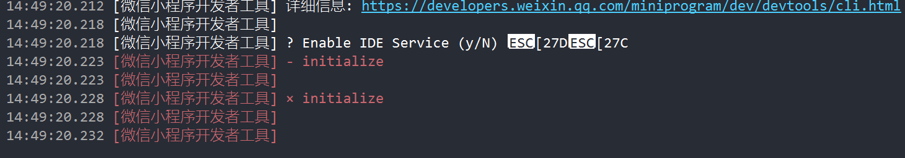

解决方案：

打开【[微信开发者工具](https://so.csdn.net/so/search?q=微信开发者工具&spm=1001.2101.3001.7020)】

点击【设置】-【安全设置】-【服务端口】开启即可。

### 在使用unnicloud函数的时候，像数据进行增删改查的操作时出错

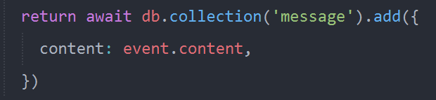

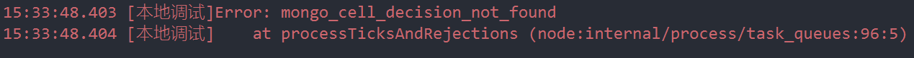

解决方案：

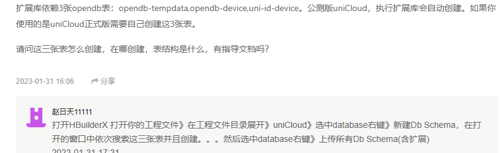

如果添加了这三个表还不行。就在unicloud的控制台端提前建表。

## B站视频的源码

```html
<template>
  <view>
    <view class="content">
      <!-- Vue中使用v-model指令来实现表单元素和数据的双向绑定。监听用户的输入，然后更新数据。 -->
      <input type="text" class="input" v-model="content" placeholder="留言">
      <button type="primary" @click="publish()" size="mini">发布</button>
    </view>
    <view v-for="item in list" :key='item._id'>
      <view class="box">
        <view>{{item.content}}</view>
      </view>
    </view>
  </view>
</template>

<script>
  export default {
    data() {
      return {
        content: '',
        list: [],
      }
    },
    onLoad() {
      // uniCloud.callFunction都是去查找云函数。
      uniCloud.callFunction({
        // name指定使用哪一个cloudfunctions中的云函数
        name: 'fun',
        // data是传给云函数的数据
        data: {
          // api在函数中用于类似switch的用法
          api: "getMessages",
        } //then中需要写一个回调函数，res是对调函数的参数，中括号里的是回调函数。
      }).then(res => {
        this.list = res.result.data;
      })
    },
    methods: {
      publish() {
        uniCloud.callFunction({
          name: 'fun',
          data: {
            api: 'publish',
            content: this.content,
          }
        }).then(res => {
          console.log(res.result);
          this.list.push({
            _id: res.result._id,
            // 这地方不能用 res.result.content代替，因为查询语句的返回值是
            content: this.content,
          })
          this.content = "";
        })
      }
    }
  }
</script>

<style>
  .content {
    display: flex;
    align-items: center;
    margin: 40px;
  }

  .input {
    border-bottom: 1px solid #ccc;
    padding: 6rpx;
    flex: 1;
  }

  .box {
    margin: 40rpx;
    border-bottom: 1px solid #ccc;
    padding: 20rpx;
  }


  .text-area {
    display: flex;
    justify-content: center;
  }

  .title {
    font-size: 36rpx;
    color: #8f8f94;
  }
</style>
```


# HBuilderX使用小程序UI组件库 Vant Weapp

Vant Weapp[使用手册](https://youzan.github.io/vant-weapp/#/home)

如果有不明白的可以看Vant[教程](https://www.w3cschool.cn/vantlesson/)

用该组件对上文开发的留言板小程序进行界面优化。具体操作如下

## 在HBuilderX中引入Vant Weapp组件库

### 通过npm安装

[参考网站](https://blog.csdn.net/Establish_bug/article/details/102792796)

注意事项：

1. 在我的微信开发者工具中没有找到本地设置中的**使用npm模块**，所以默认使用了npm模块。

2. 按照链接的步骤可以完成操作，但是如果使用了自定义的组件，没有办法使用自动代码提示功能。

3. Vant Weapp中没有`input`输入框的标签，所以使用他们提供的`van-field`标签

   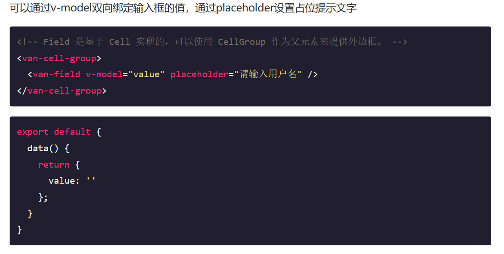

   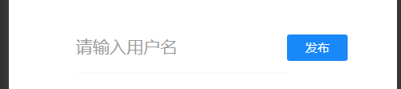

### 如何给vue vant框架 Field 输入框加一个外边框

使用`custom-style`属性

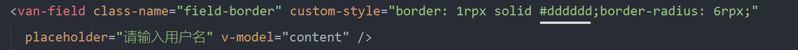

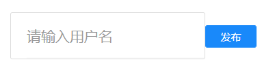

但是看起来很丑，如何在输入框和按钮之间拉开一些距离呢.

在使用的过程中发现Vant Weapp组件库并不适合Vue。所以使用[ uView](https://www.uviewui.com/)组件。

# HBuilderX使用uni-app生态专用的UI框架uView

按照官网的教程来，进入快速上手的项目之后微信小程序没有任何的显示。

快速上手的这个项目就是没有显示，问题不大。把button之类的复制进去就可以了。

重点就需要在之后注意一下`u-action-sheet`在之后是如何操作的。

## 用到之前开发的yd项目中

将`input`标签的内容改为`u-field`标签。但是uView2组件库中不存在`u-field`组件，所以使用`u-input`组件。

```html
<u--input clearable placeholder="请输入内容" border="bottom" v-model="content"></u--input>
```

可以通过Vue.js的语法来实现将uView2组件的属性绑定为动态值，下面将border的值绑定为了动态的值。

```html
<u--input clearable placeholder="请输入内容" :border="nptBorder" v-model="content"></u--input>
<script>
export default {
    data() {
      return {
        nptBorder: 'surround',
      }
    },
</script>
```

下面将`button`改为`u-button`使用

```html
<u-button type="primary" @click="publish()" size="small">发布</u-button>
```

出现了button的长度太长，直接占满整条view的情况。

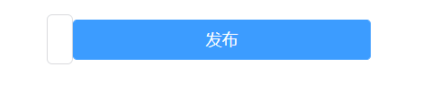

根据文档原文所说，如果是为了修改按钮与其他元素之间的距离或者宽度等，可以给按钮外面套一个`view`元素，控制这个`view`与其他元素的距离或者宽度，即可达到同等效果。

```html
<view style="width:20%;margin:5rpx;">
	<u-button type="primary" @click="publish()" size="small">发布</u-button>
</view>
```

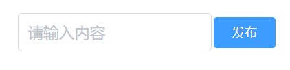

如果想自己改变输入框的样式，可以使用`u-input`标签中的`customStyle`属性。

```html
 <u--input :customStyle="customInputStyle" clearable placeholder="请输入内容" :border="nptBorder" v-model="content"></u--input>
 <script>
export default {
    data() {
      return {
        customInputStyle: {
          backgroundColor: 'red',
          color: 'white',
          borderRadius: '10rpx'
        }
      }
    },
</script> 
```

其中注意返回的数据和属性都要用驼峰写法，效果如下

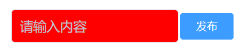


下面用uView美化下面的输出列表窗口。

```html
<u-list>
    <u-list-item v-for="item in list" :key="item._id">
        <u-cell :title="item.content">
            <!-- name是icon的名字，不同的name是不同的icon -->
            <u-icon slot="right-icon" size="25" name="minus-circle" @click="del(item._id)"></u-icon>
        </u-cell>
    </u-list-item>
</u-list>
```

## 添加新的功能，前端点击之后可以删除对应的cell的引用

首先是前端的函数，函数传进来的参数是每个`item`的`id`，再调用对应的云函数进行删除操作。在vue文件的js代码和之前的相同，调用`name`是`fun`的云函数，然后传数据给云函数，`api`是`del`，`key`是之前说的`item`的`id`。

之后是自定义云函数fun，key就是要删除的数据的id，然后根据key获得对应的表项，之后对该表项进行删除。

```js
if (event.api == 'del') {
    console.log('del' + event.key);
    return await db.collection('message').doc(event.key).remove();
}
```

<u>注意：这里我们使用的是nosql语法，其实在uniCloud中已经更新到了使用jql语法，我们下节会介绍如何把nosql改成jql</u>

`remove()`的返回值是 {"affectedDocs":1,"deleted":1}。虽然此时在数据库中已经把数据删除了，但是并没有在前端把数据删除。所以还需要在回调函数中对list的内容进行删除。具体代码如下。

```js
.then(res => {
    console.log(res.result);
    this.list.some((item, i) => {
        if (item._id == key) {
            this.list.splice(i, 1)
            // 在数组的some方法中，如果return true，就会立即终止这个数组的后续循环,所以相比较foreach，如果想要终止循环，那么建议使用some
            return true;
        }
});
```


# 独立开发一个运动及情绪监测的微信小程序

## 功能概述

- **用户注册和资料管理**：注册账号并填写个人资料，包括基本信息(昵称、年龄、学校、专业、手机号码)和兴趣爱好等。
- **运动监测**：记录运动状态，包括步数、距离、速度、卡路里消耗、运动时间等参数。
- **情绪监测**：记录情绪状态。1）情绪标签：使用情绪标签创建标签或关键词，描述情绪体验，例如压力、兴奋、困惑等。2）情绪评分：采用量表评估情绪强度和持续时间。
- **心理健康自测****：**提供多种信效度高的心理健康评估量表进行自测，例如焦虑、抑郁、压力等。定期追踪和提醒：允许用户定期进行心理健康自测，并提供定期提醒和通知。通过持续的自测和跟踪，帮助用户了解自己的心理健康状况的变化和趋势。**
- **数据可视化：**将运动和情绪数据以图表和统计数据的形式展示给用户，帮助他们更好地了解自己的运动和情绪变化。1）运动日志：使用折线图可以显示运动距离、运动时长等数据随时间的变化。2）情绪日志：根据每日情绪标签、情绪评分生成图表，将情绪变化趋势可视化，例如每天的情绪分布、情绪的高峰和低谷等。情绪状态也可以通过情绪日历表或者色块的方式进行可视化，让用户更清晰地了解自己的情绪变化**
- **用户反馈和建议：**用户反馈和改进，通过用户调查或意见反馈功能，了解用户的体验和需求，以改进和优化微信小程序。

## 设计思路


