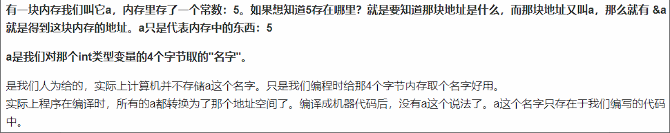
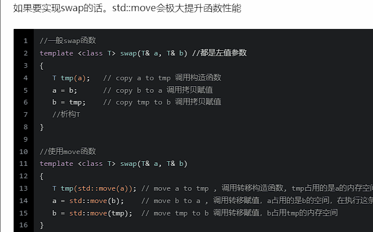
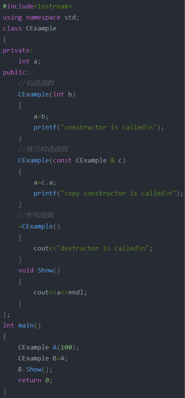

# **C++**

### 1.  C++中智能指针和指针的区别是什么

智能指针会自动管理内存，可以自动释放。普通的指针需要手动管理内存，释放。智能指针实际上是对普通指针加了一层封装机制，智能指针就是一个类。

### 2. 述 C++ 中智能指针的特点，简述 new 与 malloc 的区别

智能指针可以自动管理资源，包括share,unique和weak。在函数结束的时候会自动释放内存

new是C++中的操作符，malloc是函数。

new 不止是分配内存，而且会调用类的构造函数，同理delete会调用类的析构函数，而malloc则只分配内存，不会进行初始化类成员的工作，同样free也不会调用析构函数。

new相当于有两个步骤：分配内存(和malloc一样)；触发构造函数。

malloc在使用的时候需要显式填入申请内存的大小

new的返回值是对象类型的指针。而malloc返回的是void*,需要再一步进行强制类型转化。

### 3. 简述C++右值引用与转移语义

左值表达式表示的是对象的身份，右值表达式表达的是对象的值。

左值对应变量的存储位置，右值对应变量的值本身

有地址的变量就是左值，没有底质的字面值、临时值就是右值

引用就是给变量取一个别名，和原来的变量公用一块空间。一个变量可以有多个引用，改变引用的值就改变了变量的值

左值引用要求右边的值必须能够取出地址

左值的声明符号为”&”， 为了和左值区分，右值的声明符号为”&&”。

转移语句可以将资源(堆，系统对象等)从一个对象转移到另一个对象

右值引用实现了转移语义和精确传递，能够消除两个对象相互交互时不必要的对象拷贝，节省运算存储资源，提高运行效率。

### 4. 只定义析构函数，会自动生成哪些构造函数

与构造函数相反，析构函数是在对象被撤销的时自动调用。

默认生成的析构函数只能释放类的普通数据成员所占用的空间, 无法释放通过 new 或 malloc 进行申请的空间。

只定义析构函数，会生成默认构造函数和拷贝构造函数。

默认构造函数是给对象赋予初始值的函数

拷贝构造函数有编辑器调用来完成一些基于同一类的其他对象的构建及初始化

