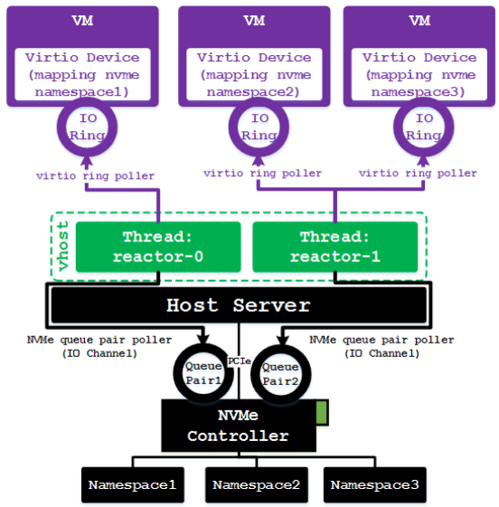

# **0307 腾讯 游戏数据 软件开发 数据工程 实训基地 一面**

30min左右

### **自我介绍**

（要求三分钟左右）

### **项目**

第三个项目，量化指标如何对比。和其他相关算法的区别

### **八股**

快速排序的思路，

时间复杂度，

什么时候时间复杂度最大

如何把时间复杂度最大的时候处理成nlogn

### **手撕**

二分查找

[34. 在排序数组中查找元素的第一个和最后一个位置](https://leetcode.cn/problems/find-first-and-last-position-of-element-in-sorted-array/)

# 0327 美团一面

## 八股

### 数据结构

#### 数组和链表的区别

#### 哈系树了解吗，介绍一下，hashmap

#### B树和B+树

### 网络

#### http有哪些状态码，3开头，404，403，400，5开头

#### 介绍MVC的设计模式，MVC设计模式的优点

### linux

#### 查看文件的行数

#### 查找文本中的关键字

grep

#### 重命名文件的命令

## 手撕代码

二分查找

[34. 在排序数组中查找元素的第一个和最后一个位置](https://leetcode.cn/problems/find-first-and-last-position-of-element-in-sorted-array/)

# 0827 百度面试

## 项目问题

#### SPDK是否支持一个虚拟磁盘，多个虚拟机的形式

支持的。每个虚拟机对应一个I/O Ring，I/O Ring是被reactor线程轮询的，每一个reactor绑定到一个线程中。一个I/O环是否对应一个虚拟磁盘呢？

#### 一次机器启动，识别设备的过程，PCIE流程

https://blog.csdn.net/zhuzongpeng/article/details/137380345

上电操作：当Linux系统启动或热插拔NVMe SSD时，系统需要为其供电并初始化驱动程序，使其能够识别和访问SSD。

下电操作：在系统关闭、休眠、热拔插设备或出于节能目的需要断开SSD电源时，系统需确保数据安全，然后执行一系列操作以关闭SSD电源。

#### SPDK创建虚拟块设备的过程

#### 对DPU了解的多吗，DPU是什么

DPU模拟设备的原理是基于软件定义技术路线支撑基础设施层资源虚拟化，专注于数据处理

#### DPU+虚拟机架构

多个虚拟机连接一个host主机，host主机中插有DPU，存储集群（多个SSD）通过网络连接host，SPDK通过DPU提供虚拟块存储设备给每个虚拟机

# 0912 快手一面

### TCP三次握手和四次挥手讲一下

### 服务端应用下线和整个服务端机器下线对三次握手有什么不同的影响

### 一个I/O请求提交到磁盘经历的过程，从页缓存怎么到磁盘的

# 0913 美团1面

### 对java垃圾回收是否了解

### 介绍一下java中的hash map，什么时候扩容

### Spark的shuffle还能如何优化

### 在大数据的应用层如何做优化

### 包含spark shuffle操作的原语

### shell的使用，awk用法

# 0919 字节1面

### 为什么C++要比JAVA和Python快

### 为什么https要用一次非对称加密和一次对称加密

### Spark性能优化的方式

# 0923 腾讯TEG 对象存储一面

### C++11的新特征

### 实现多态的方法

### map底层是通过什么来实现的

### 介绍一下堆排序

### 稳定的排序算法和不稳定的排序算法分别有什么

### 在有向图中如何判断有没有环

### 介绍B树和B+树，数据库都用B树还是B+树

### tcp三次握手中的两个队列

发送缓冲区和接受缓冲区

### Linux中如何抓tcp的包

tcpdump

### 客户端如果send()成功了，是否代表消息发送成功了

`send()`函数调用成功只能说明数据已经从客户端的发送缓冲区开始发送出去了，但并不能保证数据已经成功到达服务端。应用程序应该使用TCP的确认机制和错误处理来确保数据的可靠传输。

### Linux中如何查看tcp接口

### strace命令的作用

监控用户空间和内核空间的交互

# 0925华为二面

### windows和Linux中队文件系统的定义有什么不同

### Linux文件系统中的权限管理

### C++面向对象中的设计原则

# 0926字节三面

### 介绍一下LRU的相关知识

### 为什么选择服务架构

我还想做一些偏向业务层的东西，从研究内容到实习，都是从底层在逐渐往上层走。

能直接在一个系统或者app中有看得到的产出还是会比较安心

像我实习的时候，几乎就只有一个人在做，然后产出就会比较慢，效果看到的不明显。正反馈获得的少

## hr面

