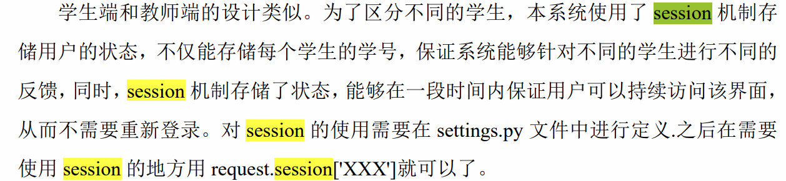

# **基于知识图谱的Python课程教学辅助平台**

## **项目背景**

## **我的工作**

## 技术难点和解决方案

### 1.     **如何使用session的，用到cookie了吗**

### 2.     **如何运行学生所写的程序**

如果是编程题，先存储学生的答案，然后，在程序中通过subprocess命令调用中间脚本文件，该脚本文件会读取该题目对应的每一组测试用例，然后测试学生提交的代码，输出得分，被subprocess.check_output()得到

# **数据中心存储流量控制**

随着网络带宽的快速提升，以及NVM等高速存储介质的出现和推广，网络IO成为系统瓶颈，RDMA因为它高带宽低延迟的特性在数据中心内部得到了广泛的运用，但是这些发展同时也带来了一些新的问题，比如RDMA协议中的共享接收缓存的管理问题，主机端的IO处理速率与IO到达速率不匹配而导致的主机拥塞问题，以及SSD处理能力随不同业务场景，IO分布发生动态变化的问题。在以前，大部分网络研究只关注网络环节，但在实际业务场景中，主机拥塞也是一个不容忽视的问题。而我们的研究主要就是针对主机端内部可能出现的瓶颈点，包括共享接收队列SRQ、SSD，最后我们还对主机端和网络端的协同拥塞控制进行了研究。

## **项目背景**

## **我的工作**

## **技术难点和解决方案**

### 仿真平台的集成

一开始选择了DiskSim作为仿真器接入，但是没有后台垃圾回收机制，而且在请求中无法指定读写地址。又重新换了MQSim使用仿真器。

MQSim和ns3的时间同步也是问题，因为在MQSim原平台中它是一次性读取所有的预先设定好的IO请求，然后将它们都执行完后返回一个平均处理延时。但是HPCC平台提交过来的请求是一个一个的，而且时间是不定的，其次拥塞控制需要得到每个请求的处理延时。

为了解决这个问题，我们通过分析MQSim的源码，发现MQSim在处理一个请求时，会生成多个子事件并插入到事件链表中，一开始我们是想从整个事件链表中找出每个IO请求的开始事件和结束事件，然后进行相应的修改来满足我们的需求，但我们发现这比较困难，而且可能花费的工作量也比较大。之后我们是通过在MQsim的一个事件注册的函数中调用回调函数直接将每个事件插入到HPCC仿真平台的事件链表中来实现的。然后我们也通过修改平均处理延时的统计函数获取了单个IO的处理延时

### 协议实现

HPCC目前还不能够完全模拟基于RDMA的存储网络。我们首先结合RDMA流程和HPCC源码抽象出了我们需要实现的模块、类、和流程控制的方法。因为RDMA协议主要是现在网卡部分，所以除了新增模块之外，我们需要在不影响原有功能的前提下，对HPCC仿真平台的底层代码进行修改，来支持上层的RDMA协议。其中主要包括UDP、ACK包头的修改，以及在收到数据包后我们如何对这个数据包所携带的命令进行解析，并判断当前这个命令所处的流程阶段，然后再进行相应的流程控制，拥塞信息的收集以及速率调节，然后为了支持RDMA协议中的RNR机制，我们还额外构建了RNR数据包。

### 平台架构设计中两个协议之间的交互

## **相关问题**

### RDMA 流程

### NVMe 流程

### NVMe over RDMA流程

### RDMA有socket层吗，socket层是做什么的

### 为什么选择HPCC平台

HPCC是基于ns3实现的，并且实现了很多拥塞控制的算法，同时实现了QP，SQE等接口，可以继续实现RDMA。

### simpy架构

SimPy 是一个基于标准 Python 以进程为基础的离散事件仿真框架。SimPy 是离散事件驱动的仿真库。所有活动部件，例如车辆、顾客,、即便是信息，都可以用 `process` (进程) 来模拟。这些 `process` 存放在 `environment` (环境) 。所有 `process` 之间，以及与`environment` 之间的互动，通过 `event` (事件) 来进行.

# **基于云存储平台的租户性能保障算法**
