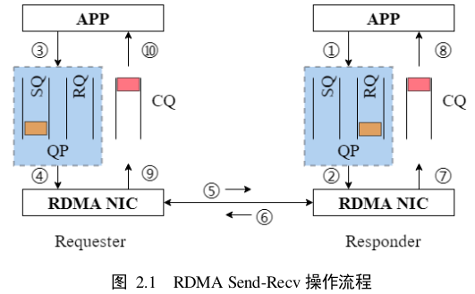
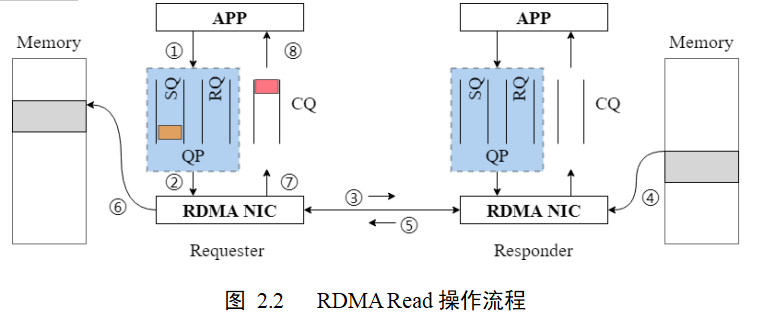
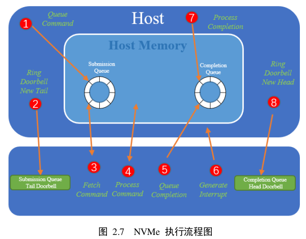
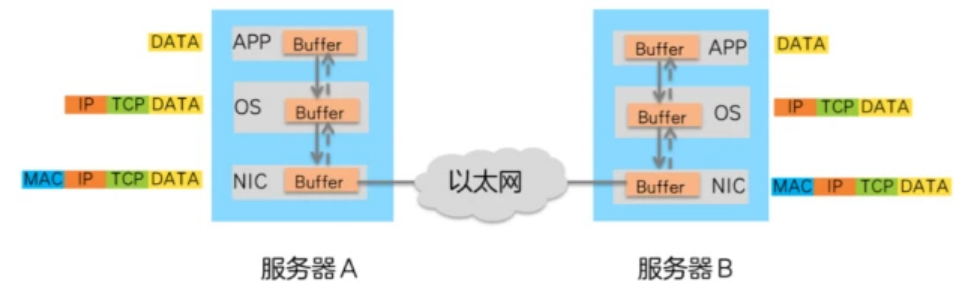
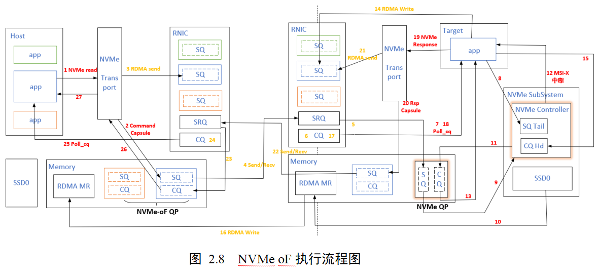
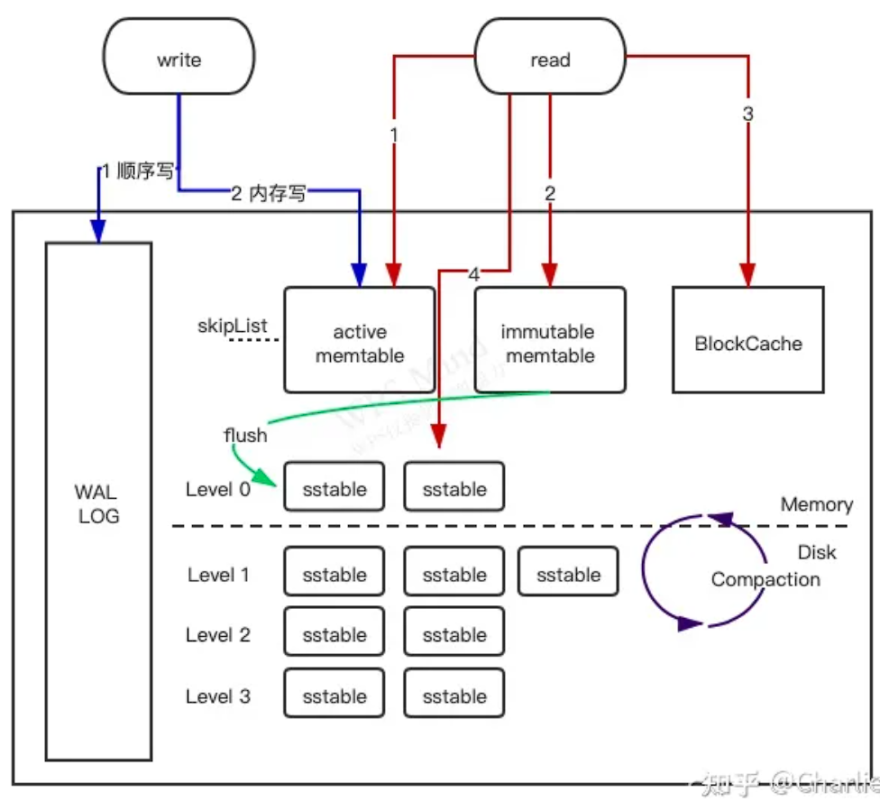

# **基于知识图谱的Python课程教学辅助平台**

## **项目背景**

## **我的工作**

## 技术难点和解决方案

### 1.     **如何使用session的，用到cookie了吗**

### 2.     **如何运行学生所写的程序**

如果是编程题，先存储学生的答案，然后，在程序中通过subprocess命令调用中间脚本文件，该脚本文件会读取该题目对应的每一组测试用例，然后测试学生提交的代码，输出得分，被subprocess.check_output()得到

## 相关问题

### 1. 为什么使用图数据库

### 2. 图数据库和一般的关系型数据库相比，优点是什么

# **数据中心存储流量控制**

随着网络带宽的快速提升，以及NVM等高速存储介质的出现和推广，网络IO成为系统瓶颈，RDMA因为它高带宽低延迟的特性在数据中心内部得到了广泛的运用，但是这些发展同时也带来了一些新的问题，比如RDMA协议中的共享接收缓存的管理问题，主机端的IO处理速率与IO到达速率不匹配而导致的主机拥塞问题，以及SSD处理能力随不同业务场景，IO分布发生动态变化的问题。在以前，大部分网络研究只关注网络环节，但在实际业务场景中，主机拥塞也是一个不容忽视的问题。而我们的研究主要就是针对主机端内部可能出现的瓶颈点，包括共享接收队列SRQ、SSD，最后我们还对主机端和网络端的协同拥塞控制进行了研究。

## **项目背景**

## **我的工作**

## **技术难点和解决方案**

### 仿真平台的集成

一开始选择了DiskSim作为仿真器接入，但是没有后台垃圾回收机制，而且在请求中无法指定读写地址。又重新换了MQSim使用仿真器。

MQSim和ns3的时间同步也是问题，因为在MQSim原平台中它是一次性读取所有的预先设定好的IO请求，然后将它们都执行完后返回一个平均处理延时。但是HPCC平台提交过来的请求是一个一个的，而且时间是不定的，其次拥塞控制需要得到每个请求的处理延时。

为了解决这个问题，我们通过分析MQSim的源码，发现MQSim在处理一个请求时，会生成多个子事件并插入到事件链表中，一开始我们是想从整个事件链表中找出每个IO请求的开始事件和结束事件，然后进行相应的修改来满足我们的需求，但我们发现这比较困难，而且可能花费的工作量也比较大。之后我们是通过在MQsim的一个事件注册的函数中调用回调函数直接将每个事件插入到HPCC仿真平台的事件链表中来实现的。然后我们也通过修改平均处理延时的统计函数获取了单个IO的处理延时

### 协议实现

HPCC目前还不能够完全模拟基于RDMA的存储网络。我们首先结合RDMA流程和HPCC源码抽象出了我们需要实现的模块、类、和流程控制的方法。因为RDMA协议主要是现在网卡部分，所以除了新增模块之外，我们需要在不影响原有功能的前提下，对HPCC仿真平台的底层代码进行修改，来支持上层的RDMA协议。其中主要包括UDP、ACK包头的修改，以及在收到数据包后我们如何对这个数据包所携带的命令进行解析，并判断当前这个命令所处的流程阶段，然后再进行相应的流程控制，拥塞信息的收集以及速率调节，然后为了支持RDMA协议中的RNR机制，我们还额外构建了RNR数据包。

### 平台架构设计中两个协议之间的交互

## **相关问题**

### RDMA 流程

RDMA verbs操作主要支持两种网络操作语义：

消息语义——SEND、RECV。但是和Socket不同，在发送端SEND之前，接收端必须要先RECV,因为RDMA的内存都是用户自己来管理，接收端需要事先确定内存资源来接收发送端发送的数据。

内存语义——RDMA提供READ、WRITE两种内存语义操作，它们都需要知道远程机器内存虚拟地址。内存语义操作不需要CPU参与实际数据传输部分，完全由网卡硬件完成，所以可以达到很高的带宽和很低的延迟。

#### SEND-RECV操作

1. 接收端APP以WQE的形式下发一次RECV任务。
2. 接收端的RNIC从RQ中获取该WQE(包含地址)，准备接收数据
3. 发送端APP以WQE的形式下发一次SEND任务
4. 发送端的RNIC从SQ中获取该任务，从内存中获取待发送的数据，组装数据包
5. 发送端网卡将数据包通过物理链路层发送给接收端网卡
6. 接收端RNIC收到数据，进行校验后回复ACK报文给发送端
7. 接收端RNIC将数据放到WQE中指定的位置，然后生成CQE，放置到CQ中
8. 接收端APP取得任务完成信息
9. 发送端网卡收到ACK后，生成CQE，放置到CQ中
10. 发送端APP取得任务完成信息

### RDMA  READ 操作

1. 请求端APP以WQE的形式下发一次READ任务。
2. 请求端网卡从SQ中取出WQE，解析信息。
3. 请求端网卡将READ请求包通过物理链路发送给响应端网卡。
4. 响应端收到数据包，解析目的虚拟地址，转换成本地物理地址，解析数据，从指定内存区域取出数据。
5. 响应端硬件将数据组装成回复数据包发送到物理链路。
6. 请求端硬件收到数据包，解析提取出数据后放到READ WQE指定的内存区域中。
7. 请求端网卡生成CQE，放置到CQ中。
8. 请求端APP取得任务完成信息。

### NVMe 流程

在NVMe的定义中，每一个NVMe命令的执行流程有八步，Host与Controller之间通过PCIe TLP传递信息。

1. Host提交一个新的Command。Host下发一个新的Command时，将其放入Host内存的SQ中。
2. Host通知controller提取Command。Host把Command写入SQ后，通知Controller自己已经提交了新的请求需要处理。这个过程通过更新在Controller内部的寄存器SQ Tail Doorbell来完成
3. Controller从SQ中获取请求，然后在Controller内部的SQ Head Pointer寄存器中更新Head所在的位置。可以一次取出多个command进行批量处理
4. Controller执行从SQ中提取的请求。执行Read/Wirte Command时，这个过程会与Host Memory进行数据传递。
5. Controller将Commands的完成状态写入CQ。此时，Controller需要更新CQ Tail Pointer寄存器。
6. Controller通过发送一个中断信息告知Host，之前提交的commands已经执行完毕。
7. Host检查CQ中的Completion信息
8. Host更新Controller内部的CQ Head Doorbell。通知Controller Host已经处理了Command的执行结果。

### 为什么RDMA更快

在数据中心，服务器A向服务器B发送数据的过程如下：

1. CPU控制数据由A的APP Buffer拷贝到操作系统Buffer。
2. CPU控制数据在操作系统（OS）Buffer中添加TCP、IP报文头。
3. 添加TCP、IP报文头后的数据传送到网卡（NIC），添加以太网报文头。
4. 报文由网卡发送，通过以太网络传输到服务器B网卡。
5. 服务器B网卡卸载报文的以太网报文头后，将其传输到操作系统Buffer。
6. CPU控制操作系统Buffer中的报文卸载TCP、IP报文头。
7. CPU控制卸载后的数据传输到APP Buffer中。

### NVMe over RDMA流程

### 为什么NVMe over RDMA更快

### RDMA有socket层吗，socket层是做什么的

### 为什么选择HPCC平台

HPCC是基于ns3实现的，并且实现了很多拥塞控制的算法，同时实现了QP，SQE等接口，可以继续实现RDMA。

### simpy架构

SimPy 是一个基于标准 Python 以进程为基础的离散事件仿真框架。SimPy 是离散事件驱动的仿真库。所有活动部件，例如车辆、顾客,即便是信息，都可以用 `process` (进程) 来模拟。这些 `process` 存放在 `environment` (环境) 。所有 `process` 之间，以及与`environment` 之间的互动，通过 `event` (事件) 来进行.

### 当前云厂商都使用的拥塞控制算法是什么样子的

### PSCC的优点和创新点是什么

考虑了

# **基于云存储平台的租户性能保障算法**

## 技术难点和解决方案

### 给QEMU虚拟机搭建网络

## 相关问题

### 介绍一下RocksDB

RocksDB是KV存储引擎

RocksDB使用Log-Structured Merge（LSM）trees做为基本的数据存储结构。

RocksDB主要组成 & 读、写和压缩操作流程图解

