# **基于知识图谱的Python课程教学辅助平台**


## **项目背景**


## **我的工作**


## 技术难点和解决方案

### 1.     **如何使用session的，用到cookie了吗**

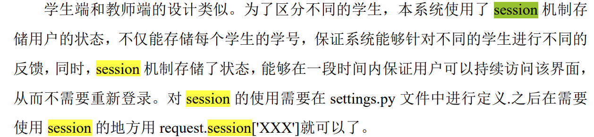

### 2.     **如何运行学生所写的程序**

如果是编程题，先存储学生的答案，然后，在程序中通过subprocess命令调用中间脚本文件，该脚本文件会读取该题目对应的每一组测试用例，然后测试学生提交的代码，输出得分，被subprocess.check_output()得到

## 相关问题

### 1. 为什么使用图数据库

### 2. 图数据库和一般的关系型数据库相比，优点是什么

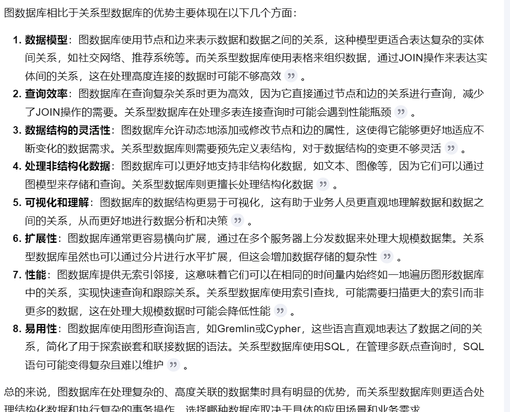


# **数据中心存储流量控制**

随着网络带宽的快速提升，以及NVM等高速存储介质的出现和推广，网络IO成为系统瓶颈，RDMA因为它高带宽低延迟的特性在数据中心内部得到了广泛的运用，但是这些发展同时也带来了一些新的问题，比如RDMA协议中的共享接收缓存的管理问题，主机端的IO处理速率与IO到达速率不匹配而导致的主机拥塞问题，以及SSD处理能力随不同业务场景，IO分布发生动态变化的问题。在以前，大部分网络研究只关注网络环节，但在实际业务场景中，主机拥塞也是一个不容忽视的问题。而我们的研究主要就是针对主机端内部可能出现的瓶颈点，包括共享接收队列SRQ、SSD，最后我们还对主机端和网络端的协同拥塞控制进行了研究。

## **项目背景**


## **我的工作**


## **技术难点和解决方案**

### 仿真平台的集成

一开始选择了DiskSim作为仿真器接入，但是没有后台垃圾回收机制，而且在请求中无法指定读写地址。又重新换了MQSim使用仿真器。

MQSim和ns3的时间同步也是问题，因为在MQSim原平台中它是一次性读取所有的预先设定好的IO请求，然后将它们都执行完后返回一个平均处理延时。但是HPCC平台提交过来的请求是一个一个的，而且时间是不定的，其次拥塞控制需要得到每个请求的处理延时。

为了解决这个问题，我们通过分析MQSim的源码，发现MQSim在处理一个请求时，会生成多个子事件并插入到事件链表中，一开始我们是想从整个事件链表中找出每个IO请求的开始事件和结束事件，然后进行相应的修改来满足我们的需求，但我们发现这比较困难，而且可能花费的工作量也比较大。之后我们是通过在MQsim的一个事件注册的函数中调用回调函数直接将每个事件插入到HPCC仿真平台的事件链表中来实现的。然后我们也通过修改平均处理延时的统计函数获取了单个IO的处理延时

### 协议实现

HPCC目前还不能够完全模拟基于RDMA的存储网络。我们首先结合RDMA流程和HPCC源码抽象出了我们需要实现的模块、类、和流程控制的方法。因为RDMA协议主要是现在网卡部分，所以除了新增模块之外，我们需要在不影响原有功能的前提下，对HPCC仿真平台的底层代码进行修改，来支持上层的RDMA协议。其中主要包括UDP、ACK包头的修改，以及在收到数据包后我们如何对这个数据包所携带的命令进行解析，并判断当前这个命令所处的流程阶段，然后再进行相应的流程控制，拥塞信息的收集以及速率调节，然后为了支持RDMA协议中的RNR机制，我们还额外构建了RNR数据包。

### 平台架构设计中两个协议之间的交互

因为NVMe-oF协议是基于RDMA协议实现的，RDMA层需要向上一层提供统一的操作接口，也就是RDMA Verbs，同时，在NVMe层我们也需要对RDMA层提交上来的命令进行解析并进行相应的流程控制，我们需要理清NVMe-oF命令、NVMe本地命令以及RDMA命令之间的关系，并处理好它们之间的转换。两个协议之间的交互非常的复杂，涉及的类也很多，一开始我们常常会碰到头文件的交叉引用问题，这个问题我们后面通过回调函数的方式解决了，然后也会出现流程错误的问题，这个我们主要是通过优化架构的设计，减少代码之间的耦合性来解决的。同时我们也会规范平时写代码的习惯来避免一些小错误的发生，比如说添加必要的注释，统一变量和函数的命名规则等等。


## **相关问题**


### RDMA 流程

RDMA verbs操作主要支持两种网络操作语义：

消息语义——SEND、RECV。但是和Socket不同，在发送端SEND之前，接收端必须要先RECV,因为RDMA的内存都是用户自己来管理，接收端需要事先确定内存资源来接收发送端发送的数据。

内存语义——RDMA提供READ、WRITE两种内存语义操作，它们都需要知道远程机器内存虚拟地址。内存语义操作不需要CPU参与实际数据传输部分，完全由网卡硬件完成，所以可以达到很高的带宽和很低的延迟。

#### SEND-RECV操作

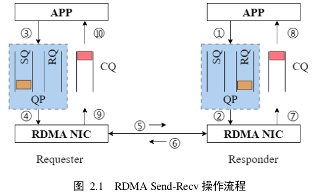

1. 接收端APP以WQE的形式下发一次RECV任务。
2. 接收端的RNIC从RQ中获取该WQE(包含地址)，准备接收数据
3. 发送端APP以WQE的形式下发一次SEND任务
4. 发送端的RNIC从SQ中获取该任务，从内存中获取待发送的数据，组装数据包
5. 发送端网卡将数据包通过物理链路层发送给接收端网卡
6. 接收端RNIC收到数据，进行校验后回复ACK报文给发送端
7. 接收端RNIC将数据放到WQE中指定的位置，然后生成CQE，放置到CQ中
8. 接收端APP取得任务完成信息
9. 发送端网卡收到ACK后，生成CQE，放置到CQ中
10. 发送端APP取得任务完成信息

### RDMA  READ 操作

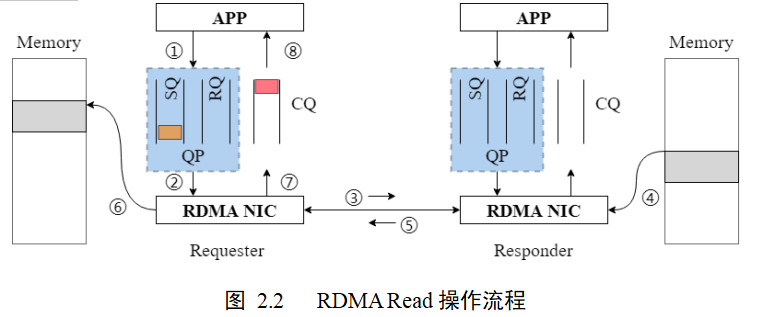

1. 请求端APP以WQE的形式下发一次READ任务。
2. 请求端网卡从SQ中取出WQE，解析信息。
3. 请求端网卡将READ请求包通过物理链路发送给响应端网卡。
4. 响应端收到数据包，解析目的虚拟地址，转换成本地物理地址，解析数据，从指定内存区域取出数据。
5. 响应端硬件将数据组装成回复数据包发送到物理链路。
6. 请求端硬件收到数据包，解析提取出数据后放到READ WQE指定的内存区域中。
7. 请求端网卡生成CQE，放置到CQ中。
8. 请求端APP取得任务完成信息。


### NVMe 流程

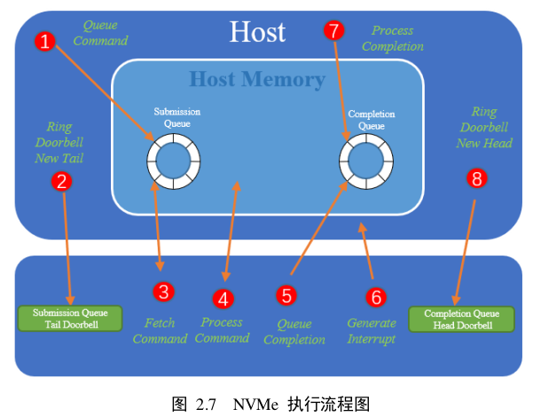

在NVMe的定义中，每一个NVMe命令的执行流程有八步，Host与Controller之间通过PCIe TLP传递信息。

1. Host提交一个新的Command。Host下发一个新的Command时，将其放入Host内存的SQ中。
2. Host通知controller提取Command。Host把Command写入SQ后，通知Controller自己已经提交了新的请求需要处理。这个过程通过更新在Controller内部的寄存器SQ Tail Doorbell来完成
3. Controller从SQ中获取请求，然后在Controller内部的SQ Head Pointer寄存器中更新Head所在的位置。可以一次取出多个command进行批量处理
4. Controller执行从SQ中提取的请求。执行Read/Wirte Command时，这个过程会与Host Memory进行数据传递。
5. Controller将Commands的完成状态写入CQ。此时，Controller需要更新CQ Tail Pointer寄存器。
6. Controller通过发送一个中断信息告知Host，之前提交的commands已经执行完毕。
7. Host检查CQ中的Completion信息
8. Host更新Controller内部的CQ Head Doorbell。通知Controller Host已经处理了Command的执行结果。


### 为什么RDMA更快，数据在tcp中的发包流程

在数据中心，服务器A向服务器B发送数据的过程如下：

Linux网络包发送过程(tcp)

https://www.bilibili.com/read/cv17519678/#:~:text=%E6%88%91%E8%BF%99%E9%87%8C%E5%85%88%E7%BB%99%E5%A4%A7%E5%AE%B6%E5%87%86%E5%A4%87%E4%BA%86


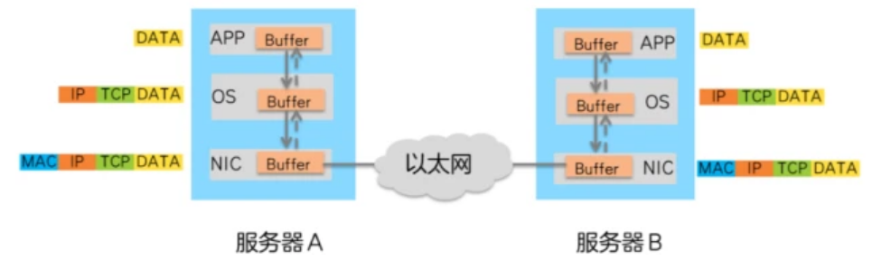

1. CPU控制数据由A的APP Buffer拷贝到操作系统Buffer。
2. CPU控制数据在操作系统（OS）Buffer中添加TCP、IP报文头。
3. 添加TCP、IP报文头后的数据传送到网卡（NIC），添加以太网报文头。
4. 报文由网卡发送，通过以太网络传输到服务器B网卡。
5. 服务器B网卡卸载报文的以太网报文头后，将其传输到操作系统Buffer。
6. CPU控制操作系统Buffer中的报文卸载TCP、IP报文头。
7. CPU控制卸载后的数据传输到APP Buffer中。

### RDMA除了Kernel bypass还有什么别的优势吗

RDMA的特点是绕过内核，将网络层和传输层都放在了硬件（网卡）中，数据报文进入到网卡之后，在网卡硬件上完成了四层解析，上送到应用层软件。

RDMA的优势如下：

> - 零拷贝(Zero-copy) - 应用程序能够直接执行数据传输，在不涉及到网络软件栈的情况下。数据能够被直接发送到缓冲区或者能够直接从缓冲区里接收，而不需要被复制到网络层。
>
> - 内核旁路(Kernel bypass) - 应用程序可以直接在用户态执行数据传输，不需要在内核态与用户态之间做上下文切换。
>
> - 不需要CPU干预(No CPU involvement) - 应用程序可以访问远程主机内存而不消耗远程主机中的任何CPU。远程主机内存能够被读取而不需要远程主机上的进程（或CPU)参与。远程主机的CPU的缓存(cache)不会被访问的内存内容所填充。
>
> - 消息基于事务(Message based transactions) - 数据被处理为离散消息而不是流，消除了应用程序将流切割为不同消息/事务的需求。
>
> - 支持分散/聚合条目(Scatter/gather entries support) - RDMA原生态支持分散/聚合。也就是说，读取多个内存缓冲区然后作为一个流发出去或者接收一个流然后写入到多个内存缓冲区里去。

### NVMe over RDMA流程

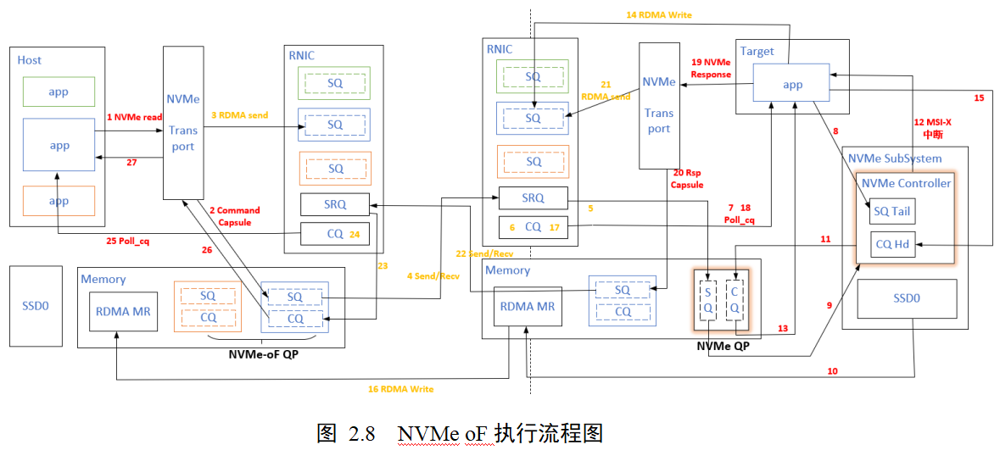


### 为什么NVMe over RDMA更快

### RDMA有socket层吗，socket层是做什么的

### RDMA 的三种通信协议

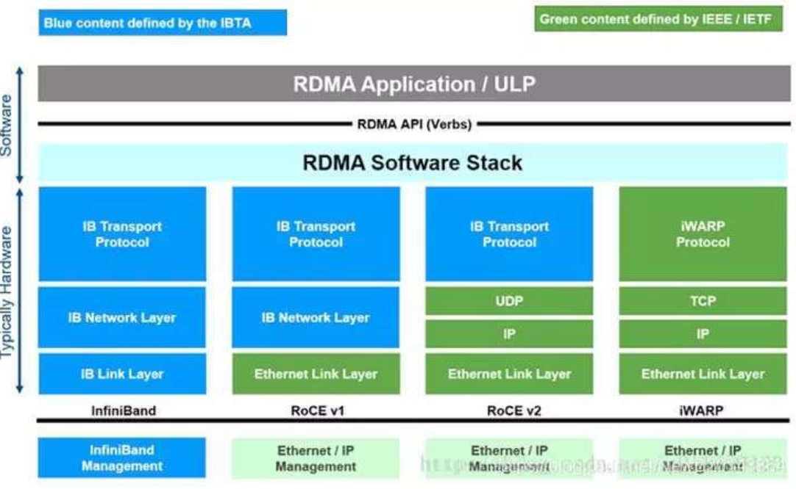

==InfiniBand==

InfiniBand能够让服务器与服务器之间、服务器与存储设备之间的数据传输不需要主机CPU的参与。a

==RoCE==

RoCE是现在最有效的以太网低延迟方案。它消耗很少的CPU负载，在数据中心桥接以太网中利用优先流控制（PFC）来达到网络的无损连接。

==iWARP==

iWARP也是一个允许在TCP上执行RDMA的网络协议。IB和RoCE中存在的功能在iWARP中不受支持。它支持在标准以太网基础设施（交换机）上使用RDMA


### 为什么选择HPCC平台

HPCC是基于ns3实现的，并且实现了很多拥塞控制的算法，同时实现了QP，SQE等接口，可以继续实现RDMA。

### simpy架构

SimPy 是一个基于标准 Python 以进程为基础的离散事件仿真框架。SimPy 是离散事件驱动的仿真库。所有活动部件，例如车辆、顾客,即便是信息，都可以用 `process` (进程) 来模拟。这些 `process` 存放在 `environment` (环境) 。所有 `process` 之间，以及与`environment` 之间的互动，通过 `event` (事件) 来进行.


### 基于RDMA和tcp的拥塞控制算法有什么区别

然后rdma里面没有丢包信号，一般用ecn，延时，int信号

tcp用丢包，延时信号，极少有ecn

tcp的乘性减少，因子一般是固定的，rdma的因子一般是和拥塞程度有关

> ECN和INT都是数据中心中专门制定的交换机上提供的标签
>
> RDMA是保序重传，如果丢包后面的包就作废了，就会使用go back n重传。

==ecn==：通过在IP头部嵌入一个拥塞指示器和在TCP头部嵌入一个拥塞确认实现。兼容ECN的交换机和路由器会在检测到拥塞时对网络数据包打标记

==INT==：使用INT（交换机的功能），发送方可以从ACK数据包准确地知道流路径上的链路负载，这有助于发送方进行准确的流量调整。

### 当前云厂商都使用的拥塞控制算法是什么样子的

tcp一般是cubic，其次是bbr

==cubic==：Cubic是一种基于TCP的拥塞控制算法，通过模拟TCP拥塞窗口随时间增长的立方方程来自动调节数据传输速率。

==bbr==：BBR（Bottleneck Bandwidth and Round-trip propagation time）是一种拥塞控制算法，旨在通过测量网络路径的最小瓶颈带宽和往返时间来直接找到最优的发送速率。

rdma最多是dcqcn，谷歌用swift，阿里用hpcc

==DCQCN==：利用ECN发现拥塞风险并快速做出反应。它还允许主机开始以线路速率进行积极传输，并在短暂拥塞后快速提高速率。

DCQCN缺点：对于一致的低延迟，网络需要在缓冲区中保持稳定的小队列（这意味着较低的ECN标记阈值），而如果ECN标记阈值较低，发送方将过于保守，无法增加流量。低延迟和高吞吐形成了冲突

==HPCC==：利用交换机的INT功能携带网络信息，根据该信息调节速率。测量链路BDP，控制网络流量 Inflight等于BDP(Bandwidth Delay Product，延迟带宽积)且发送速率等于网络带宽

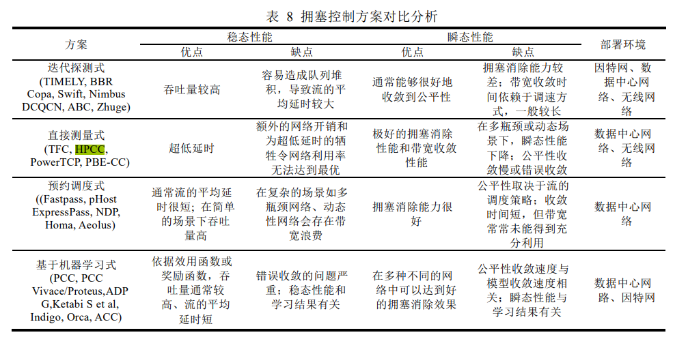

### PSCC的优点和创新点是什么

考虑了

# **基于云存储平台的租户性能保障算法**

## 技术难点和解决方案

### 给QEMU虚拟机搭建网络

qemu连接网络的几个模式User模式，Tap模式，socket模式

一开始由于看到了virbr0，并且qemu默认的是nat模式，最开始选择nat模式。但是为了方便外网能够访问虚拟机，之后选择使用了桥接模式。

==NAT模式==：当虚拟机需要与外部网络通信时，虚拟化软件会将虚拟机的网络流量转发到宿主机（Host Machine）上。宿主机通过Network Address Translation（NAT）技术将虚拟机的私有IP地址转换成宿主机在外部网络上可路由的公共IP地址，同时维护一个转发表来跟踪虚拟机的网络连接。

==桥接模式==：将多个网络接口连接在一起形成一个单一的网络。虚拟机会和主机IP在同一个网段中。将虚拟机出来的计算机,直接连入当前的网络环境中,并且独占IP。


最后是先配置网桥，再提供TAP给虚拟机

QEMU的networking主要有两部分

- 提供给guest的虚拟网络设备，例如PCI网卡
- 与虚拟网卡交互的网络后端，例如把packets放到host的网络中

后端使用的是Tap，就是qemu启动命令中的配置，一个虚拟机


## 相关问题

### 块存储，文件存储和对象存储的区别

==对象存储==是一种基于对象的存储方式，它将数据和元数据封装在对象中，并通过唯一的标识符进行管理。对象存储具有高度的可扩展性和灵活性，适用于大量非结构化数据的存储，如图片、视频、文档等。由于其分布式特性，对象存储也常用于构建云基础设施。

==文件存储==是一种基于文件的存储方式，它将数据组织成文件和文件夹的形式，并使用标准的文件系统接口进行访问。文件存储支持POSIX接口，这意味着用户可以使用熟悉的文件操作命令（如ls、cat、cp等）来管理数据。文件存储适用于需要共享和访问特定文件的场景，如办公文档、媒体编辑等。

==块存储==是一种基于块的存储方式，它将数据分成固定大小的数据块，并通过块地址进行访问。块存储提供的是裸设备或原始数据块的存储，因此具有极高的性能和可靠性。块存储适用于需要高性能和可靠性的场景，如数据库、虚拟化等。


### 存储中常见的IO调度算法

==Noop==：就是简单的先来先服务

==CFQ==：完全公平队列，基于时间片的角度去保障公平。每个进程都会有一个IO优先级，

DeadLine：控制最长时间

BFQ：

MQFQ：

FIOS：


### NVMe中数据SQ，CQ和DoorBell的作用，host是如何知道SQ中SQE提交了的，host是如何从CQ中的CQE取数据的


### SPDK中虚拟机创建一个虚拟磁盘的过程，vhost层如何创建虚拟磁盘的

https://blog.csdn.net/lzw06061139/article/details/131509412

执行vhost命令后，会==启动一个常驻服务==，该服务会依次进行spdk框架及自定义部分的初始化，spdk框架初始化包括：==reactor初始化==，==bdev子系统初始化==，vhost子系统初始化，启动unix socket的监听，等待客户端的链接；

spdk app程序启动时，==通过SPDK_SUBSYSTEM_REGISTER注册各子系统到SPDK框架==（通过g_subsystems列表管理所有的子系统），通过SPDK_SUBSYSTEM_DEPEND注册子系统的依赖（通过g_subsystems_deps列表管理所有的子系统依赖）

==**磁盘初始化**==

rpc框架根据method名找到初始化方法（==bdev_nvme_attach_controller==）过程中会调用spdk_io_device_register注册名为bdev_Malloc0的io_device并添加到g_io_devices列表，将磁盘和io_device关联起来，同时代表Malloc0磁盘的spdk_bdev对象被添加到g_bdev_mgr.bdev_names的名字红黑树，g_bdev_mgr.bdevs设备列表，最后将磁盘malloc_disk添加到g_malloc_disks全局列表。

**vhost-blk初始化**

```
rpc_vhost_create_blk_controller
	spdk_vhost_blk_construct    //初始化spdk_vhost_blk_dev设备，关联tranport ops，spdk_bdev
		vhost_dev_register  // 设置后端操作集vhost_blk_device_backend， spdk_vhost_dev设备添加到全局列表g_vhost_devices
			vhost_user_blk_create_ctrlr //调用transport ops操作集的create_ctrlr方法创建控制器
				vhost_user_dev_register  //创建spdk_thread，添加到全局threads列表，并通过_scheduler_thread调度到reactor
					vhost_register_unix_socket  //创建unix socket监听，设置通知回调g_spdk_vhost_ops，并启动监听回调为：vhost_user_server_new_connection

```


### SPDK中把数据写入磁盘的过程

==创建I/O QP==

首先进行IO Qpair的创建，然后分配一段buffer用来传输数据以及后续数据接收的验证。

==提交SQ==


==轮询CQ==


### SPDK的多Reactor如何进行资源竞争，SPDK源码里面

SPDK的特性，一个主Reactor，一个副Reactor

### 一个设备上电的流程

https://blog.csdn.net/u010443710/article/details/105639449

Host对PCIe设备的扫描采用的是深度优先算法。

第一步，PCI Host主桥扫描Bus 0上的设备（在一个处理器系统中，一般将Root complex中与Host Bridge相连接的PCI总线命名为PCI Bus 0），系统首先会忽略Bus 0上的embedded EP等不会挂接PCI桥的设备，主桥发现Bridge 1后，将Bridge1 下面的PCI Bus定为 Bus 1，系统将初始化Bridge 1的配置空间。

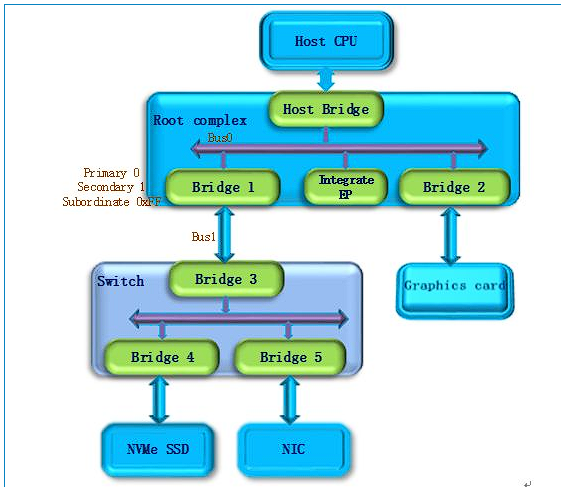

第二步，系统开始扫描Bus 1，将会发现Bridge 3，并发现这是一个switch设备。系统将Bridge 3下面的PCI Bus定为Bus 2，并将该桥的Primary Bus Number 和 Secondary Bus Number寄存器分别设置成1和2，和上一步一样暂时把Bridge 3 的Subordinate Bus Number设为0xFF。

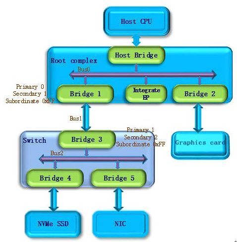

第三步，系统继续扫描Bus 2，将会发现Bridge 4。继续扫描，系统会发现Bridge下面挂载的NVMe SSD设备，系统将Bridge 4下面的PCI Bus定为Bus 3，并将该桥的Primary Bus Number 和 Secondary Bus Number寄存器分别设置成2和3，因为Bus3下面挂的是端点设备（叶子节点），下面不会再有下游总线了，因此Bridge 4的Subordinate Bus Number的值可以确定为3。

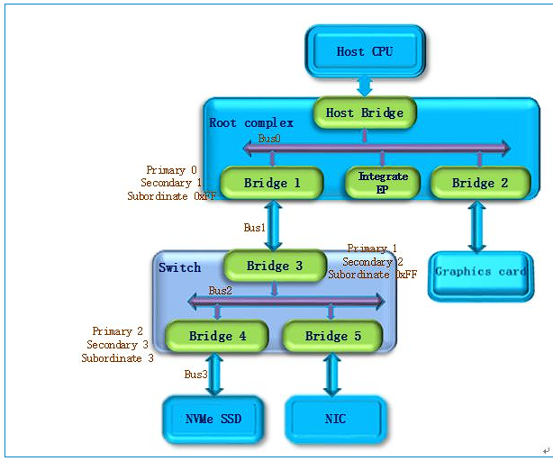

上电操作：当Linux系统启动或热插拔NVMe SSD时，系统需要为其供电并初始化驱动程序，使其能够识别和访问SSD。


### DPU是什么，介绍一下DPU+虚拟机架构

DPU模拟设备的原理是基于软件定义技术路线支撑基础设施层资源虚拟化，专注于数据处理

多个虚拟机连接一个host主机，host主机中插有DPU，存储集群（多个SSD）通过网络连接host，SPDK通过DPU提供虚拟块存储设备给每个虚拟机


### 介绍一下RocksDB

RocksDB是KV存储引擎

RocksDB使用Log-Structured Merge（LSM）trees做为基本的数据存储结构。

RocksDB主要组成 & 读、写和压缩操作流程图解

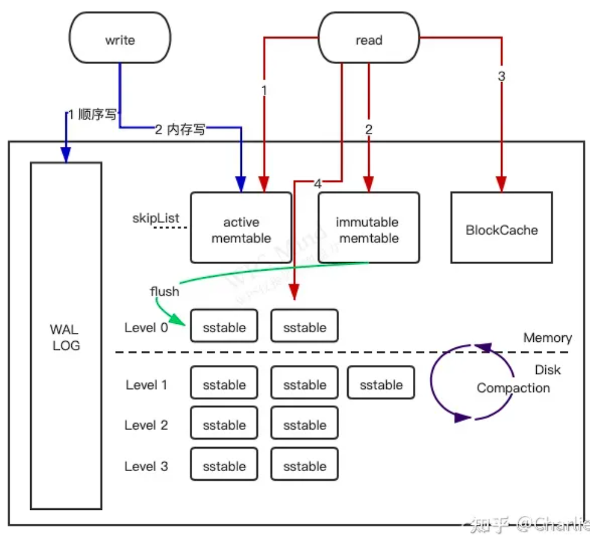

# Spark加速

我相当于从0开始入手这个项目，学习java maven，spark yarn等知识。一开始rdma+ess的项目是基于阿里云自研的erdma的。遇到的第一个问题就是地址错误的问题，发现问题出现在RDMA中的注册mr原语。我是通过ucx中间件实现spark对rdma原语的调用。就对UCX提供的响应接口进行了单测，多次调用注册mr的api，复现了问题。与此同时，对原生spark-ucx进行了测试，发现了问题

## 遇到的问题以及解决方案

### 在erdma中单独出现的问题

### 性能回退的问题


## 相关问题

### spark性能优化的方式

#### 开发调优

Spark基本的开发原则：RDD串设计，算子的合理使用，特殊操作的优化

==**原则一：避免创建重复的RDD**==

通常来说，我们在开发一个Spark作业时，首先是基于某个数据源（比如Hive表或HDFS文件）创建一个初始的RDD；接着对这个RDD执行某个算子操作，然后得到下一个RDD；以此类推，循环往复，直到计算出最终我们需要的结果。在这个过程中，多个RDD会通过不同的算子操作（比如map、reduce等）串起来，这个“RDD串”，就是RDD lineage，也就是“RDD的血缘关系链”。

我们在开发过程中要注意：对于同一份数据，只应该创建一个RDD，不能创建多个RDD来代表同一份数据。

> Spark中的RDD是什么
>
> RDD（Resilient Distributed Dataset）叫做**弹性分布式数据集**，**是Spark中最基本的数据抽象**，它代表一个不可变、可分区、里面的元素可并行计算的集合。
>
> 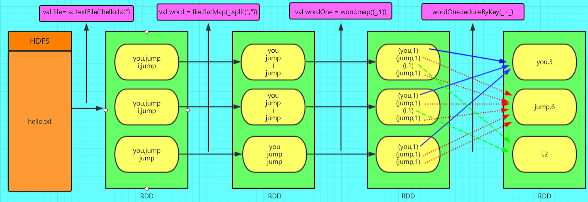
>
> RDD的五大特征：
>
> 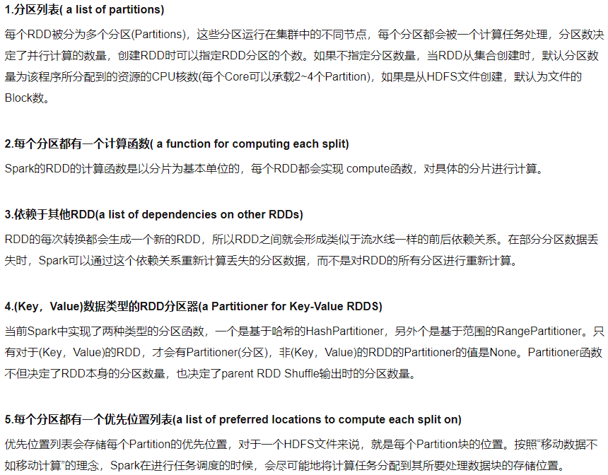

**==原则二：尽可能复用同一个RDD==**

<u>对不同的数据执行算子操作时还要尽可能地复用一个RDD。</u>比如说，有一个RDD的数据格式是key-value类型的，另一个是单value类型的，这两个RDD的value数据是完全一样的。那么此时我们可以只使用key-value类型的那个RDD，因为其中已经包含了另一个的数据。

**原则三：对多次使用的RDD进行持久化**

Spark中对于一个RDD执行多次算子的默认原理是这样的：每次你对一个RDD执行一个算子操作时，都会重新从源头处计算一遍，计算出那个RDD来，然后再对这个RDD执行你的算子操作。这种方式的性能是很差的。

因此对于这种情况，我们的建议是：<u>对多次使用的RDD进行持久化。此时Spark就会根据你的持久化策略，将RDD中的数据保存到内存或者磁盘中</u>。以后每次对这个RDD进行算子操作时，都会直接从内存或磁盘中提取持久化的RDD数据，然后执行算子，而不会从源头处重新计算一遍这个RDD，再执行算子操作。

==**原则四：避免使用shuffle类算子**==

shuffle过程，简单来说，就是将分布在集群中多个节点上的同一个key，拉取到同一个节点上，进行聚合或join等操作。shuffle过程会发生大量的磁盘文件读写操作。因此在我们的开发过程中，<u>尽可能避免使用reduceByKey、join、distinct、repartition等会进行shuffle的算子。</u>

==**原则五：使用map-side预聚合的shuffle操作**==

所谓的map-side预聚合，说的是<u>在每个节点本地对相同的key进行一次聚合操作</u>，map-side预聚合之后，每个节点本地就只会有一条相同的key，因为多条相同的key都被聚合起来了。其他节点在拉取所有节点上的相同key时，就会大大减少需要拉取的数据数量，从而也就减少了磁盘IO以及网络传输开销。

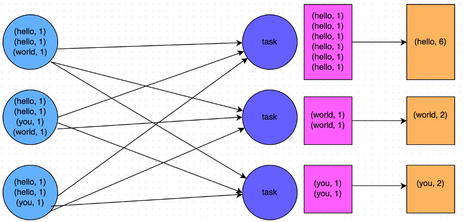

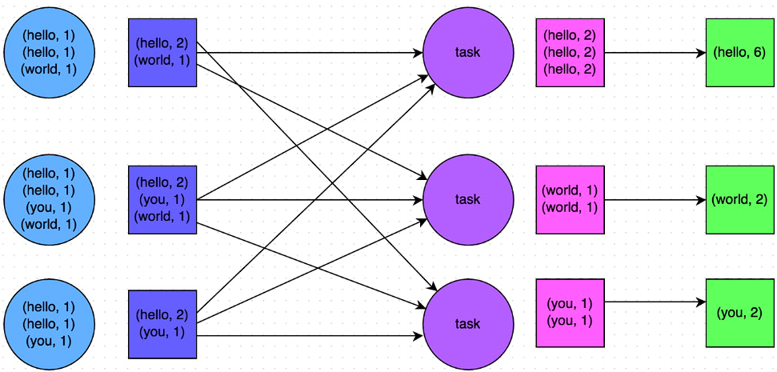

#### 资源参数调优

==Executor的内存==主要分为三块：第一块是让task执行我们自己编写的代码时使用，默认是占Executor总内存的20%；第二块是让task通过shuffle过程拉取了上一个stage的task的输出后，进行聚合等操作时使用，默认也是占Executor总内存的20%；第三块是让RDD持久化时使用，默认占Executor总内存的60%。

==task的执行速度是跟每个Executor进程的CPU core数量有直接关系的==。一个CPU core同一时间只能执行一个线程。而每个Executor进程上分配到的多个task，都是以每个task一条线程的方式，多线程并发运行的。如果CPU core数量比较充足，而且分配到的task数量比较合理，那么通常来说，可以比较快速和高效地执行完这些task线程。

#### 数据倾斜

==现象：==

- 绝大多数task执行得都非常快，但个别task执行极慢。比如，总共有1000个task，997个task都在1分钟之内执行完了，但是剩余两三个task却要一两个小时。这种情况很常见。
- 原本能够正常执行的Spark作业，某天突然报出OOM（内存溢出）异常，观察异常栈，是我们写的业务代码造成的。这种情况比较少见。


#### shuffle调优


